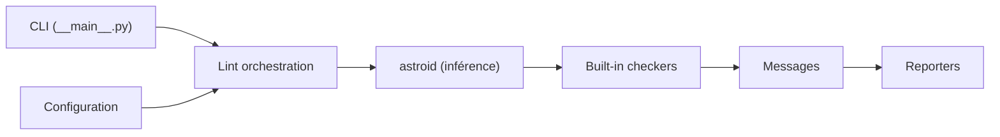

# pylint-dev/pylint

> Analyseur statique Python qui infère les valeurs du code pour repérer erreurs et mauvaises pratiques.

## Le problème
Des bogues et des écarts de style passent en revue humaine ; les linters qui se fient aux annotations de type en ratent quand le code est peu typé.

## Ce que ça fait vraiment
Analyse le code sans l'exécuter, en s'appuyant sur astroid pour inférer ce que désigne chaque nœud. Beaucoup de règles, dont certaines désactivées par défaut ; configurable ; plugins pour bibliothèques tierces (pylint-django, pylint-pydantic). Inclut pyreverse (diagrammes de paquets et classes) et symilar (code dupliqué). Plus lent que d'autres linters, assumé par le README.

## Comment c'est branché


## Essayer
```bash
pip install pylint
pip install pylint[spelling]
```

## Coût et pièges
Gratuit. Lenteur reconnue. Sur un projet historique, le README conseille de commencer par `--errors-only` puis `--disable=C,R`. Licence GPL-2.0 (icônes en CC BY-SA 4.0).

## Ce que ce n'est pas
Pas un vérificateur de types ni un formateur : le README conseille de le combiner avec mypy, black, etc. Il peut signaler des choix volontaires.

## Alternatives
ruff : bien plus rapide, avec correction automatique. flake8 : cadre pour écrire ses propres règles.

## Pour toi
À adopter en CI pour du code Python de pipeline : plus profond que ruff seul, à condition d'accepter la lenteur et de régler les messages.

