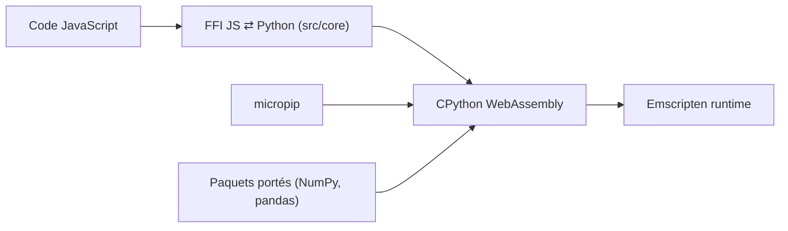

# pyodide/pyodide

> Distribution de Python compilée en WebAssembly pour exécuter du code et des paquets dans le navigateur ou Node.js.

## Le problème
Faire tourner du Python (NumPy, pandas, scikit-learn) côté client, sans serveur ni installation.

## Ce que ça fait vraiment
Port de CPython vers WebAssembly/Emscripten, avec une interface d'appel JavaScript ⇄ Python (erreurs, async/await), le chargement de paquets via `micropip` (roues pures sur PyPI) et de nombreux paquets à extensions C/C++/Rust déjà portés (NumPy, pandas, SciPy, Matplotlib, scikit-learn). Le projet comprend un CPython patché, l'interface d'appel, le code de gestion des interpréteurs et une chaîne de compilation croisée.

## Comment c'est branché

## Essayer
Aucune commande documentée. Le README propose un REPL en ligne sans installation, une distribution hébergée ou un téléchargement depuis la page des releases, plus la documentation pour les bundlers.

## Coût et pièges
Gratuit. Licence MPL-2.0 (copyleft au niveau des fichiers). Seuls les paquets purs ou déjà portés fonctionnent ; le README ne détaille pas les limites de performance ou de mémoire dans le navigateur.

## Ce que ce n'est pas
Ce n'est pas un remplacement de Python natif pour l'entraînement de modèles. Ce n'est plus l'environnement de notebooks Iodide, abandonné ; le README renvoie vers d'autres environnements.

## Alternatives
Le README ne cite pas d'alternative directe ; il renvoie aux environnements de notebooks basés sur Pyodide.

## Pour toi
Surveiller : intéressant pour des démos de données interactives sans backend, mais niche par rapport à un environnement Python classique.

