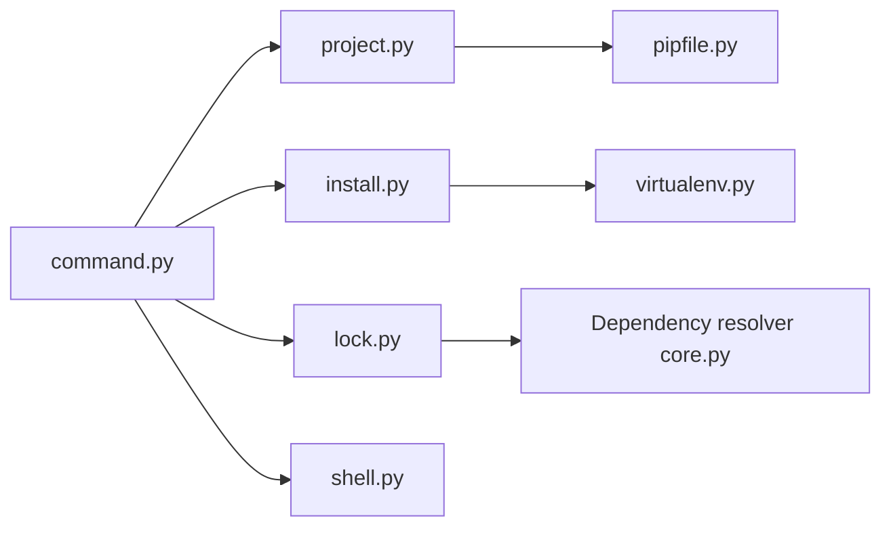

# pypa/pipenv

> Outil Python qui lie pip et virtualenv avec un Pipfile et un verrou, pour développeurs d'applications.

## Le problème
Gérer pip, virtualenv et un requirements.txt à la main, avec des builds non reproductibles.

## Ce que ça fait vraiment
Crée et gère un environnement virtuel par projet, ajoute ou retire les paquets dans le `Pipfile`, génère `Pipfile.lock` avec des hachages vérifiés à l'installation. Propose `graph`, `check` (vulnérabilités), `run`, `shell`, `sync`, `requirements`. Charge les fichiers `.env`. Installe des versions de Python si pyenv ou asdf sont présents.

## Comment c'est branché


## Essayer
```bash
pip install --user pipenv
pipenv install
pipenv install --dev
pipenv lock
pipenv run python hello.py
pipenv shell
```

## Coût et pièges
Gratuit. Python 3.10 ou plus. La complétion a changé à partir de la version 2026.5.0 : l'ancienne variable `_PIPENV_COMPLETE` ne fonctionne plus.

## Ce que ce n'est pas
Pas un outil de packaging pour publier une bibliothèque : il vise les applications. Le README ne compare pas sa vitesse à d'autres outils.

## Alternatives
- pip et virtualenv : ce qu'il remplace en les combinant.
- pyenv et asdf : cités pour l'installation de versions de Python.

## Pour toi
Surveiller : utile pour figer l'environnement d'un projet data, mais vérifie s'il est déjà remplacé dans ton équipe par un autre gestionnaire.

