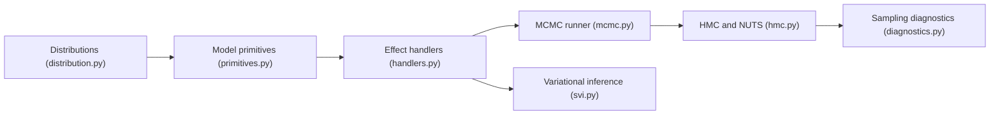

# pyro-ppl/numpyro

> Bibliothèque de programmation probabiliste sur JAX, avec MCMC et inférence variationnelle, pour statisticiens et data scientists.

## Le problème
Les modèles bayésiens hiérarchiques sont lents à échantillonner sans compilation ni accélérateur.

## Ce que ça fait vraiment
Tu écris des modèles avec les primitives de Pyro (`sample`, `param`, `plate`) et des distributions proches de `torch.distributions`. JAX compile le tout : NUTS et HMC (étapes d'intégration compilées), MixedHMC, HMCECS, BarkerMH, échantillonneur imbriqué, inférence variationnelle avec guides automatiques, Stein VI. Les effect handlers permettent des algorithmes personnalisés. Pas d'état global ni de graine globale : une clé PRNG explicite est requise.

## Comment c'est branché


## Essayer
```bash
pip install numpyro
pip install 'numpyro[cpu]'
pip install 'numpyro[cuda12]' -f https://storage.googleapis.com/jax-releases/jax_cuda_releases.html
```
Le README est tronqué à l'installation depuis les sources (après `cd numpyro`).

## Coût et pièges
Gratuit. Windows non testé ; avec jaxlib CUDA, JAX utilise le GPU par défaut (`numpyro.set_platform("cpu")` pour forcer le CPU). Le README prévient de possibles changements d'API.

## Ce que ce n'est pas
Pas un copier-coller de modèles Pyro : le code torch doit être réécrit en `jax.numpy`, de façon fonctionnelle.

## Alternatives
- Pyro : même API côté PyTorch.

## Pour toi
À adopter pour de l'inférence bayésienne rapide en Python : activité récente, API familière si tu connais Pyro.

