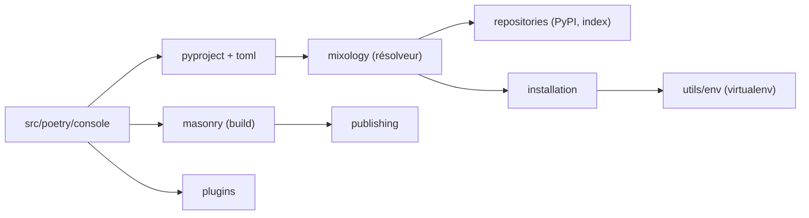

# python-poetry/poetry

> Outil de gestion de dépendances et de packaging Python, piloté par un seul fichier pyproject.toml.

## Le problème
Un projet Python éparpille ses métadonnées entre setup.py, requirements.txt, setup.cfg, MANIFEST.in et Pipfile, et les environnements divergent d'une machine à l'autre.

## Ce que ça fait vraiment
Remplace ces fichiers par un pyproject.toml unique : dépendances, groupes optionnels (docs, lint), extras, scripts, dépendances git. Un résolveur de versions (module mixology) calcule un ensemble cohérent, puis l'installateur peuple un environnement virtuel. L'outil construit aussi les paquets et les publie, et se prolonge par des plugins (export requirements.txt, bundle).

## Comment c'est branché

## Essayer
Aucune commande shell dans le README : il renvoie au script install.python-poetry.org et à la documentation d'installation sur python-poetry.org.

## Coût et pièges
Gratuit. Le dépôt compte 576 issues ouvertes ; le README les traite en appelant à contribuer. Les exemples du README supposent poetry-core >= 2.0.

## Ce que ce n'est pas
Ce n'est pas un gestionnaire de versions de Python : il s'appuie sur un interpréteur existant. Le README ne documente pas les commandes, tout est dans la doc externe.

## Alternatives
Aucune alternative citée dans le README.

## Pour toi
À adopter : un pyproject.toml unique et un verrouillage des versions rendent les environnements d'entraînement et de déploiement reproductibles.

