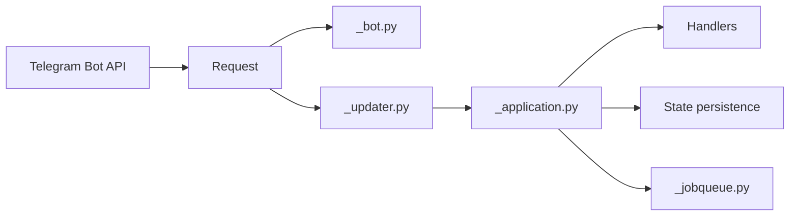

# python-telegram-bot/python-telegram-bot

> Client Python asynchrone de l'API Bot Telegram, avec un framework d'événements pour construire des bots.

## Le problème
Appeler l'API Bot Telegram à la main impose de gérer sérialisation, polling/webhooks, routage des messages et état des conversations.

## Ce que ça fait vraiment
Couvre toute l'API Bot 10.0 en objets Python typés ; `Bot` sert de façade client au-dessus de `HTTPXRequest`.
`telegram.ext` ajoute `Application`/`Updater`, des handlers (commandes, callbacks…), la persistance, `JobQueue` et un limiteur de débit.
Basé sur asyncio, non thread-safe ; Python 3.10+.
Dépendance obligatoire unique : httpx ; le reste en extras optionnels.

## Comment c'est branché


## Essayer
```bash
pip install python-telegram-bot --upgrade
pip install "python-telegram-bot[all]"
```

## Coût et pièges
Gratuit ; il faut créer un bot côté Telegram. Webhooks et JobQueue demandent les extras (tornado, APScheduler).

## Ce que ce n'est pas
Pas thread-safe. Catalogue indique GPL-3.0 alors que le README parle de LGPL-3 : à clarifier si tu redistribues une version modifiée.

## Alternatives
Aucune alternative nommée dans le README.

## Pour toi
Adopter : pour exposer un modèle ou des alertes MLOps dans Telegram, c'est la bibliothèque la plus mûre et typée, projet communautaire actif depuis 2015.
