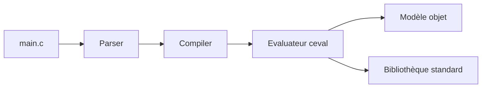

# python/cpython

> Code source de l'interpréteur Python de référence et de sa bibliothèque standard.

## Le problème
Il faut un interpréteur Python officiel, ou son code, pour exécuter, comprendre ou corriger le langage.

## Ce que ça fait vraiment
Le dépôt contient l'interpréteur (analyse, compilation en bytecode, boucle d'évaluation), le modèle objet, les fonctions natives et la bibliothèque standard (import, asyncio, threading, multiprocessing, sockets, serveur HTTP, courriel). Le README décrit la version 3.16.0 alpha 0 : c'est la branche de développement, avec build optimisé (PGO, LTO) et suite de tests.

## Comment c'est branché


## Essayer
```bash
./configure
make
make test
sudo make install
```

## Coût et pièges
Compiler demande des bibliothèques tierces selon la plateforme (voir le guide développeur). `make install` crée `python3` : utiliser `make altinstall` pour cohabiter avec une autre version.

## Ce que ce n'est pas
Ce n'est pas un installateur prêt à l'emploi : pour utiliser Python, prendre les paquets de python.org. La branche principale est une alpha, pas pour la production.

## Alternatives
Aucune alternative nommée dans le README.

## Pour toi
Adopter (via les installateurs officiels) : c'est la base de ta pile ; le dépôt sert surtout à lire ou contribuer.

