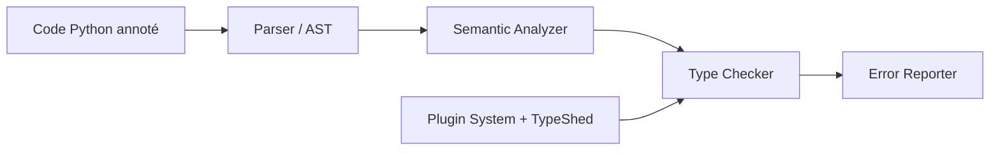

# python/mypy

> Vérificateur de types statique pour Python, pour repérer des erreurs avant l'exécution.

## Le problème
Python n'affiche les erreurs de type qu'à l'exécution, souvent tard dans un pipeline de données ou d'entraînement.

## Ce que ça fait vraiment
À partir des annotations de type (PEP 484), mypy analyse le code sans l'exécuter et signale les usages incohérents. Il supporte le typage graduel : on annote progressivement. Un mode démon (`dmypy`) accélère les vérifications incrémentales sur les gros dépôts. Mypy est lui-même compilé avec mypyc, environ 4 fois plus rapide que la version interprétée, d'après le README. Intégrations : VS Code, Vim, Emacs, PyCharm, pre-commit.

## Comment c'est branché


## Essayer
```bash
python3 -m pip install -U mypy
mypy PROGRAM
dmypy run -- PROGRAM
python3 -m pip install --no-binary mypy -U mypy
```

## Coût et pièges
Gratuit. Licence présente mais non identifiée par GitHub : à vérifier dans le fichier LICENSE. Les vérifications ne bloquent pas l'exécution. Avec pre-commit, la version miroir limite l'analyse des dépendances tierces.

## Ce que ce n'est pas
Pas un contrôle à l'exécution : les annotations restent comme des commentaires pour l'interpréteur. Le suivi compte plus de 3 000 issues ouvertes.

## Alternatives
Aucune alternative citée dans le README.

## Pour toi
Adopter : coût nul et gain direct sur la fiabilité des scripts et bibliothèques de ML ; vérifie simplement la licence exacte.

