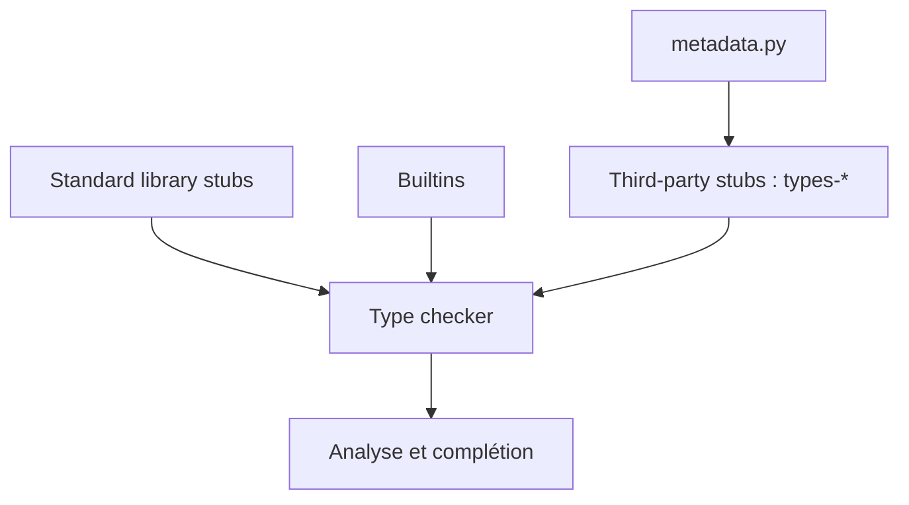

# python/typeshed

> Annotations de types externes pour la bibliothèque standard Python et des paquets tiers, consommées par les vérificateurs de types.

## Le problème
Les vérificateurs de types ont besoin de types pour du code non annoté : la stdlib et de nombreuses bibliothèques tierces.

## Ce que ça fait vraiment
Fournit des fichiers stubs pour la stdlib et les builtins, intégrés aux vérificateurs, et pour des paquets tiers, publiés sur PyPI sous la forme `types-*`. Prend en charge Python 3.10 à 3.14. Fournit aussi le paquet `_typeshed` pour des types utilitaires.

## Comment c'est branché


## Essayer
```bash
pip install types-html5lib types-requests
```

## Coût et pièges
Gratuit. Les stubs peuvent être en retard sur la bibliothèque ; le README décrit trois stratégies de versions (mêmes bornes, pin, sans pin). Une mise à jour peut faire échouer le typage. La licence est présente mais non identifiée par GitHub.

## Ce que ce n'est pas
Pas un vérificateur de types. Les problèmes de stubs se signalent ici, pas chez le projet décrit.

## Alternatives
- mypy, pyright, PyCharm : ce sont les vérificateurs qui consomment ces stubs, pas des remplaçants.

## Pour toi
À adopter : tu l'utilises déjà indirectement via ton vérificateur ; installe les `types-*` utiles à ton code de pipeline.

