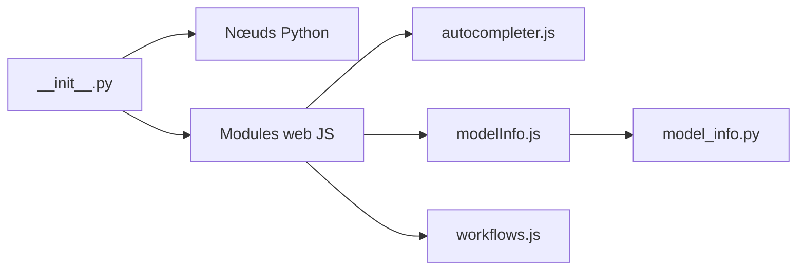

# pythongosssss/ComfyUI-Custom-Scripts

> Collection de petites améliorations de l'interface ComfyUI : autocomplétion, aperçus de modèles, outils de graphe.

## Le problème
L'éditeur de graphes ComfyUI manque de confort : retrouver un nœud, prévisualiser un LoRA, ranger un graphe.

## Ce que ça fait vraiment
Ajoute autocomplétion d'embeddings et de mots, aperçus d'images pour checkpoints et LoRA, fiche d'information de modèle, nœuds (expression mathématique, texte prédéfini, fonction sur chaîne, répéteur), auto-arrangement du graphe, couleurs, aimantation, flux d'images, notification sonore. Le script installe tout automatiquement.

## Comment c'est branché


## Essayer
```bash
git clone https://github.com/pythongosssss/ComfyUI-Custom-Scripts.git
git pull
```
Cloner dans `custom_nodes` ; `git pull` pour mettre à jour.

## Coût et pièges
Gratuit. Utilise liens symboliques ou jonctions ; désinstaller demande aussi de supprimer `web/extensions/pysssss/CustomScripts`. Certaines fonctions sont marquées « Testing » ou « WIP ». 204 issues ouvertes.

## Ce que ce n'est pas
Pas de nouveaux modèles : uniquement du confort d'interface. Le WD14 Tagger a déménagé dans un autre dépôt.

## Alternatives
ComfyUI-WD14-Tagger (tagger déplacé, cité dans le README).

## Pour toi
Pratique si tu passes du temps dans ComfyUI ; sinon sans objet : surveiller.

