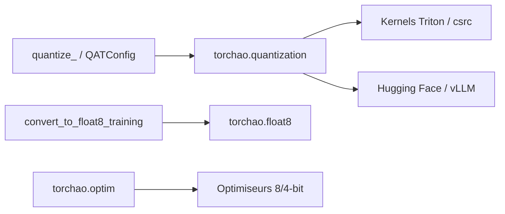

# pytorch/ao

> Quantification et entraînement en basse précision pour PyTorch : int4, float8, QAT, optimiseurs économes.

## Le problème
Servir ou entraîner de gros modèles dépasse souvent la mémoire et le budget GPU disponibles.

## Ce que ça fait vraiment
`quantize_` applique une configuration (int4, int8, float8) à un modèle ; la quantification est compatible `torch.compile` et FSDP2. Recettes de QAT (avec TorchTune), entraînement float8, optimiseurs quantifiés (AdamW8bit, 4bit, Fp8) et offload CPU. Intégrations Transformers, diffusers, vLLM, SGLang, ExecuTorch, Axolotl, TorchTitan, PEFT. Chiffres du README (1,5× en pré-entraînement, 1,89× en inférence int4) sont ceux de l'équipe.

## Comment c'est branché


## Essayer
```bash
pip install torchao
pip install torchao --index-url https://download.pytorch.org/whl/cu126
```
```python
from torchao.quantization import Int4WeightOnlyConfig, quantize_
quantize_(model, Int4WeightOnlyConfig(group_size=32, int4_packing_format="tile_packed_to_4d", int4_choose_qparams_algorithm="hqq"))
```

## Coût et pièges
Gratuit ; GPU NVIDIA pour la plupart des chemins rapides, versions de torch/CUDA à faire coïncider. 787 issues ouvertes. Licence présente mais non identifiée par GitHub.

## Ce que ce n'est pas
Pas un serveur d'inférence : il prépare le modèle, un autre outil (vLLM, ExecuTorch) le sert. Certains workflows sont « prototype ».

## Alternatives
Non documenté dans le README (il s'intègre à vLLM, SGLang, Axolotl).

## Pour toi
Adopter : brique officielle de l'écosystème PyTorch pour réduire mémoire et coût, directement utile en MLOps ; vérifie la licence avant un usage commercial.
