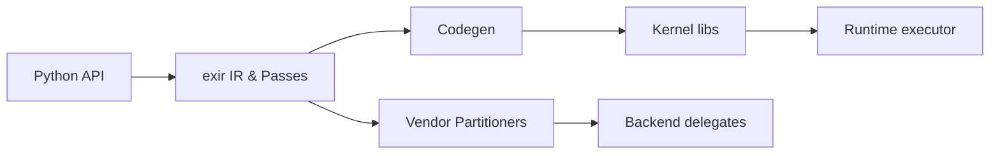

# pytorch/executorch

> Solution PyTorch pour déployer des modèles en inférence sur mobiles, appareils embarqués et microcontrôleurs.

## Le problème
Porter un modèle PyTorch sur des appareils contraints, avec les bons accélérateurs, sans réécrire la chaîne d'outils.

## Ce que ça fait vraiment
Exporte un modèle vers le format PTE via la bibliothèque `exir` (capture, passes, partitionnement), puis exécute avec un runtime C++ léger. Backends délégués : Apple CoreML et MPS, Arm Ethos-U, Qualcomm, Vulkan, XNNPACK, MediaTek, NXP, OpenVINO, Cadence. Liaisons Android, iOS et Python ; noyaux portables, optimisés et quantifiés.

## Comment c'est branché

## Essayer
Le README ne fournit pas de commande ; il renvoie à la page « Getting Started » de la documentation.

## Coût et pièges
Licence présente mais non identifiée par GitHub. Environ 1 300 issues ouvertes. Plusieurs chaînes de build (CMake, SwiftPM, Buck2).

## Ce que ce n'est pas
Pas un outil d'entraînement : l'entraînement sur appareil est cité comme expérimental. Pas un serveur d'inférence.

## Alternatives
Le README ne nomme aucune alternative.

## Pour toi
À surveiller : à connaître si tes modèles doivent tourner sur mobile ou embarqué ; sinon inutile côté serveur.
