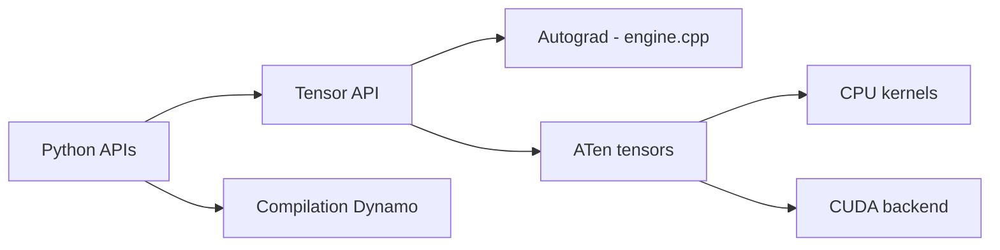

# pytorch/pytorch

> Framework Python de calcul tensoriel et de réseaux de neurones avec autograd, pour chercheurs et ingénieurs ML.

## Le problème
Écrire et entraîner des réseaux de neurones sur GPU sans réimplémenter les tenseurs, le calcul de gradients et les noyaux CUDA.

## Ce que ça fait vraiment
Fournit des tenseurs CPU/GPU façon NumPy, un autograd à bande (reverse-mode) qui enregistre les opérations puis calcule les gradients, `torch.nn` pour les couches, `torch.jit` (TorchScript), un multiprocessing qui partage la mémoire des tenseurs et des utilitaires de données. Le graphe de code ajoute la compilation (Dynamo, Inductor), le checkpoint distribué (dont formats Hugging Face) et un runtime mobile Android.

## Comment c'est branché


## Essayer
```bash
# Binaires : commandes sur https://pytorch.org/get-started/locally/
docker run --gpus all --rm -ti --ipc=host pytorch/pytorch:latest
# Depuis les sources
git clone https://github.com/pytorch/pytorch
cd pytorch
pip install --group dev
python -m pip install --no-build-isolation -v -e .
```

## Coût et pièges
Gratuit. Compilation depuis les sources : Python 3.10+, compilateur C++20, 10 Go de disque, 30 à 60 minutes. Dans Docker, `--ipc=host` ou `--shm-size` est requis pour le multiprocessing.

## Ce que ce n'est pas
Pas un framework « tout-en-un » de MLOps : ni suivi d'expériences ni serving. L'installation depuis les sources est lourde ; les binaires suffisent presque toujours. Licence non identifiée par GitHub : à relire.

## Alternatives
- TensorFlow : cité dans le README comme approche à graphe statique, écosystème Google.
- Torch / Chainer : sources d'inspiration citées, historiques.

## Pour toi
À adopter : c'est le socle de quasiment tout le travail deep learning moderne ; seule la licence « non identifiée » mérite un coup d'œil avant redistribution.

