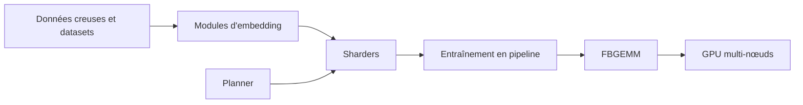

# pytorch/torchrec

> Bibliothèque PyTorch de primitives de parallélisme pour entraîner des recommandeurs à grosses tables d'embeddings.

## Le problème
Les embeddings d'un système de recommandation dépassent la mémoire d'un GPU et doivent être répartis proprement.

## Ce que ça fait vraiment
Sharders (data-parallel, table-wise, row-wise, column-wise et combinaisons), planner qui génère un plan de sharding, entraînement en pipeline qui recouvre chargement, transferts et calcul, noyaux FBGEMM, quantification, modèles DLRM et DeepFM. Le README indique que la bibliothèque alimente de nombreux modèles de production chez Meta.

## Comment c'est branché


## Essayer
```bash
git clone --recursive https://github.com/meta-pytorch/torchrec
pip install -r requirements.txt
python setup.py install develop
torchx run -s local_cwd dist.ddp -j 1x2 --script test_installation.py -- --cpu_only
```

## Coût et pièges
Suppose du multi-GPU pour tirer parti du sharding. Installation depuis les sources sur PyTorch et FBGEMM nightly, à aligner sur la version CUDA (12.6, 12.8, 12.9).

## Ce que ce n'est pas
Pas un outil clé en main : c'est une brique pour ingénieurs. Le README recommande de ne pas compiler soi-même sauf besoin.

## Alternatives
Aucune alternative nommée dans le README.

## Pour toi
À surveiller : référence si tu entraînes de grands recommandeurs, sans intérêt sans ce besoin ni cluster GPU.
