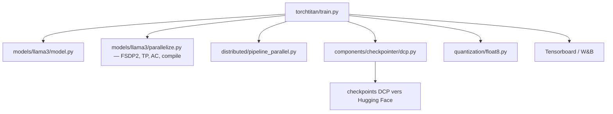

# pytorch/torchtitan

> Plateforme PyTorch native pour expérimenter et entraîner à grande échelle des modèles génératifs.

## Le problème
Appliquer FSDP2, tensor parallel, pipeline parallel et context parallel à un modèle demande d'habitude de le réécrire.
Les implémentations existantes mélangent tellement modèle et parallélisme qu'on ne sait plus ce qu'on mesure.

## Ce que ça fait vraiment
Une implémentation clean-room, minimale, des techniques de scaling PyTorch : parallélismes composables multi-dimensions avec un minimum de changements dans le code du modèle.
Initialisation sur meta device, checkpointing d'activation sélectif par opération, checkpoints distribués (y compris asynchrones) interopérables avec `torchtune`, support `torch.compile`.
Entraînement basse précision Float8 et MXFP8 sur Blackwell, états d'optimiseur BF16, accumulation de gradient dérivée de `--training.num_tokens_per_train_step`.
Loss, mémoire GPU, tokens/s, TFLOPs et MFU sont journalisés vers Tensorboard ou Weights & Biases ; les performances sont rapportées jusqu'à 512 GPU.

## Comment c'est branché


## Essayer
```bash
git clone https://github.com/pytorch/torchtitan
cd torchtitan
pip install -r requirements.txt
python scripts/download_hf_assets.py --repo_id meta-llama/Llama-3.1-8B --assets tokenizer --hf_token=...
MODULE=llama3 CONFIG=llama3_8b ./run_train.sh
```

## Coût et pièges
Il faut des GPU — l'exemple de démarrage est un Llama 3 8B sur huit GPU — et le README recommande une nightly PyTorch, pas une version stable.
`torchao` est volontairement exclu des dépendances pour ne pas resoudre `torch` de travers : à installer soi-même, en accordant la variante CUDA, uniquement pour float8/MXFP8/NVFP4.

## Ce que ce n'est pas
Ce n'est pas un framework de fine-tuning clé en main : `torchtune` est cité pour cela, torchtitan produit des checkpoints qui s'y chargent.
Ce n'est pas stable non plus — « under extensive development », et l'accès aux poids Llama passe par une demande côté Meta.

## Alternatives
- `torchtune` : cité pour le fine-tuning, en aval des checkpoints produits ici.
- vLLM : cité via `torchtitan/rl/generate.py` pour l'inférence sur les modèles entraînés.

## Pour toi
À suivre si tu veux lire une implémentation lisible des parallélismes PyTorch ; l'entrée coûte un cluster.
