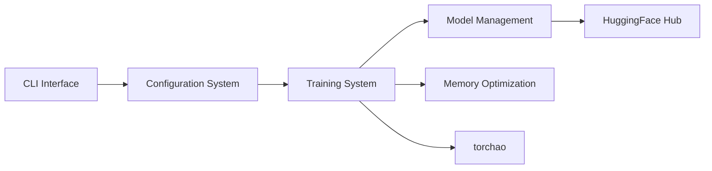

# pytorch/torchtune

> Bibliothèque PyTorch de recettes de post-entraînement de LLM (SFT, DPO, PPO, GRPO), désormais plus maintenue.

## Le problème
Affiner un LLM avec LoRA, distillation ou RLHF demande d'assembler modèles, données et optimisations mémoire.

## Ce que ça fait vraiment
CLI `tune` qui lance des recettes configurées en YAML (SFT complet ou LoRA/QLoRA, distillation, DPO, PPO, GRPO, QAT) sur un ou plusieurs GPU. Implémentations PyTorch de Llama, Gemma, Mistral, Phi et Qwen. Le README chiffre des économies de mémoire (QLoRA à 4,6 Gio sur Llama 3.2 3B dans son tableau) et détaille les combinaisons prises en charge.

## Comment c'est branché


## Essayer
```bash
pip install torch torchvision torchao
pip install torchtune
tune download meta-llama/Meta-Llama-3.1-8B-Instruct --output-dir /tmp/Meta-Llama-3.1-8B-Instruct --ignore-patterns "original/consolidated.00.pth" --hf-token <HF_TOKEN>
tune run lora_finetune_single_device --config llama3_1/8B_lora_single_device
```

## Coût et pièges
GPU requis ; jeton Hugging Face pour les poids Llama. Le README affirme le développement arrêté en 2025 : pas de nouveaux modèles ni de correctifs garantis. Le catalogue ne donne pas la licence (le README cite BSD-3-Clause dans la référence BibTeX).

## Ce que ce n'est pas
Pas une bibliothèque vivante : l'avertissement en tête annonce la fin de maintenance. Les modèles listés (Llama 4, Qwen3) resteront figés.

## Alternatives
Aucune alternative nommée dans le README ; il renvoie à un billet sur l'avenir de torchtune.

## Pour toi
Ignorer pour un nouveau projet : l'outil n'est plus maintenu, donc mieux vaut un outil actif pour le fine-tuning ; utile seulement comme référence de code.
