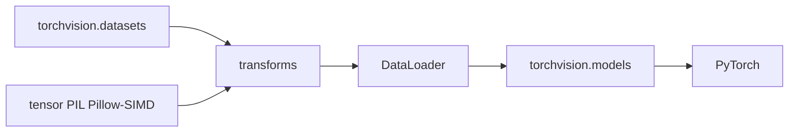

# pytorch/vision

> Jeux de données, architectures de modèles et transformations d'images courantes pour PyTorch.

## Le problème
Chaque projet de vision recommence les mêmes briques : téléchargement de dataset, prétraitement, backbone.
Réécrire ces couches à la main introduit des écarts silencieux avec les résultats publiés.

## Ce que ça fait vraiment
Fournit les datasets publics usuels, en les téléchargeant et les préparant, sans les héberger.
Livre des architectures de vision et les transformations d'images standard.
Accepte trois backends d'image : tenseurs torch, Pillow, ou Pillow-SIMD comme remplaçant direct de Pillow.
Un tableau de correspondance lie chaque version de `torchvision` à une version de `torch` et une plage Python.

## Comment c'est branché

## Essayer
Aucune commande d'installation dans le README : il renvoie aux instructions officielles de pytorch.org
pour installer des versions compatibles de `torch` et `torchvision`, et à `CONTRIBUTING.md` pour compiler.

## Coût et pièges
La compatibilité de versions est stricte : `torch 2.13` va avec `torchvision 0.28`, Python 3.10 à 3.14.
Se tromper de couple est la première cause de plantage à l'import.

## Ce que ce n'est pas
Pas un hébergeur de données : le projet ne distribue pas les datasets et ne garantit ni leur qualité ni ta licence d'usage.
Pas un cadre d'entraînement : il fournit les briques, pas la boucle.
Pas indépendant de PyTorch, évidemment : c'est une extension, pas une bibliothèque autonome.

## Alternatives
`Pillow-SIMD` — remplaçant direct de Pillow, plus rapide, cité comme backend possible.

## Pour toi
Incontournable dès que tu touches à l'image en PyTorch ; vérifie le tableau de versions avant tout `pip install`.
