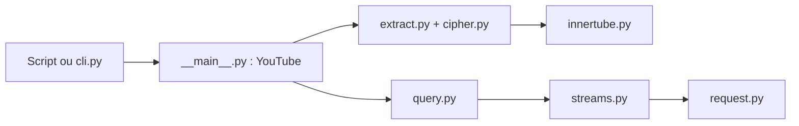

# pytube/pytube

> Bibliothèque Python sans dépendance, et CLI, pour télécharger des vidéos YouTube.

## Le problème
Récupérer une vidéo ou une playlist YouTube par script sans passer par un outil externe.

## Ce que ça fait vraiment
Crée un objet `YouTube`, liste ses flux (progressifs ou DASH), les filtre par résolution ou extension, et télécharge celui choisi. Gère aussi les sous-titres (export SRT), les playlists, les chaînes, la recherche, et des callbacks de progression.

## Comment c'est branché


## Essayer
```bash
python -m pip install pytube
pytube https://youtube.com/watch?v=2lAe1cqCOXo
```

## Coût et pièges
Gratuit. Dépend du fonctionnement interne de YouTube : 769 issues ouvertes, dernier push en août 2024. Le README admet que la version PyPI peut être en retard.

## Ce que ce n'est pas
Pas garanti stable : toute évolution côté YouTube peut casser l'extraction. Il ne contourne rien, il suit le site.

## Alternatives
- Aucune alternative nommée dans le README.

## Pour toi
À ignorer : peu actif et fragile face à YouTube ; pour alimenter un corpus audio/vidéo, vérifie d'abord un outil maintenu.

