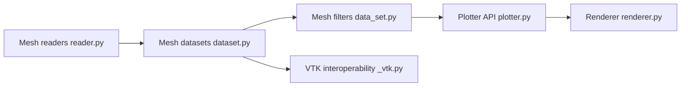

# pyvista/pyvista

> Bibliothèque Python de visualisation 3D et d'analyse de maillages, au-dessus de VTK, pour scientifiques et ingénieurs.

## Le problème
VTK est puissant mais son API C++ portée en Python est lourde ; manipuler des maillages et les afficher dans un notebook demande beaucoup de code.

## Ce que ça fait vraiment
Fournit des structures de données NumPy-natives (points, surfaces, volumes), des filtres (découpe, tranche, seuillage, lissage) et un cadre de tracé unique pour notebooks, scripts, CI et applis. Un CLI `pyvista` trace, convertit et valide des maillages. Une API d'extension par accesseurs permet à des paquets tiers d'ajouter des filtres.

## Comment c'est branché


## Essayer
```bash
pip install pyvista
conda install -c conda-forge pyvista
pyvista plot bunny.stl
pyvista convert bunny.stl .vtp
pyvista validate bunny.stl
```

## Coût et pièges
Python 3.10+. Un rendu interactif demande un affichage graphique ; en CI, le mode headless est annoncé comme supporté.

## Ce que ce n'est pas
Pas un moteur de rendu temps réel ni un outil de CAO. Le README se compare à pandas pour le 3D : c'est un positionnement des auteurs, pas une mesure.

## Alternatives
- VTK : le toolkit C++ sous-jacent, plus bas niveau.
- awesome-pyvista : liste d'outils de domaine bâtis sur PyVista.

## Pour toi
À adopter pour tout besoin de visualisation 3D scientifique en Python (nuages de points, maillages) : projet ancien (2017), actif, MIT.

