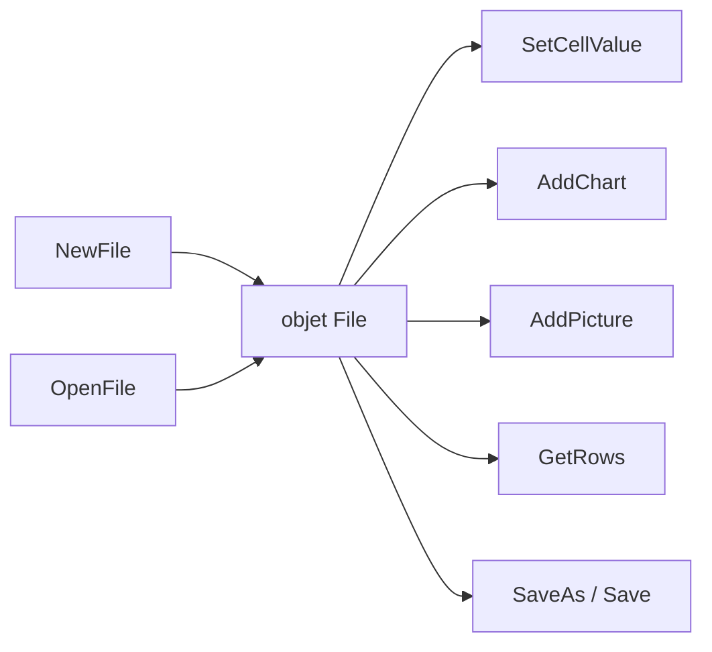

# qax-os/excelize

> Bibliothèque Go pure pour lire et écrire des classeurs Excel XLSX, XLSM et modèles associés.

## Le problème
Produire un vrai fichier Excel depuis un service Go oblige souvent à passer par un binaire externe.
Et lire un classeur de plusieurs centaines de milliers de lignes fait exploser la mémoire.

## Ce que ça fait vraiment
Lit et écrit XLAM, XLSM, XLSX, XLTM, XLTX générés par Excel 2007 et suivants.
Expose une API de flux pour générer ou lire une feuille contenant beaucoup de données.
Gère les graphiques (`AddChart`, avec séries, catégories, titre riche) sans données préalables dans la feuille.
Insère des images PNG, JPEG, GIF avec échelle, décalage dans la cellule, verrouillage et option d'impression.

## Comment c'est branché


## Essayer
```bash
go get github.com/xuri/excelize/v2
```
Puis `excelize.NewFile()`, `f.SetCellValue("Sheet2", "A2", "Hello world.")`, `f.SaveAs("Book1.xlsx")` ;
côté lecture, `excelize.OpenFile("Book1.xlsx")` puis `f.GetCellValue` ou `f.GetRows`.

## Coût et pièges
Exige Go 1.26 ou plus récent. Le chemin d'import est `github.com/xuri/excelize/v2` alors que le
dépôt est publié sous `qax-os` : ne pas s'y tromper dans les modules.

## Ce que ce n'est pas
Pas un moteur de calcul Excel complet côté README : il écrit et lit des fichiers, il ne remplace pas Excel.
Pas un outil CLI : c'est une dépendance Go, il faut écrire le programme autour.
Pas utilisable depuis Python : les exemples sont tous en Go.

## Alternatives
Aucune nommée dans le README.

## Pour toi
Pertinent seulement si ton pipeline a un morceau en Go ; en Python, openpyxl reste ton chemin.
