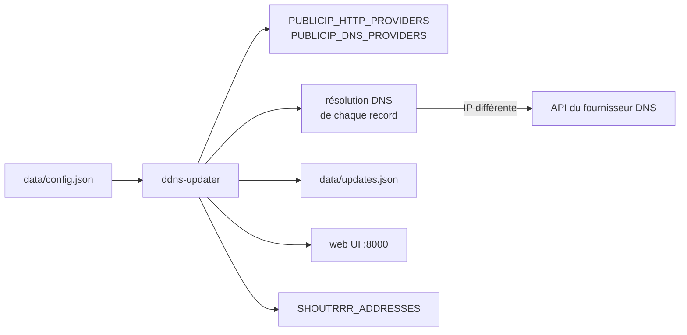

# qdm12/ddns-updater

> Programme léger qui maintient à jour des enregistrements DNS A et AAAA chez de nombreux fournisseurs.

## Le problème
Une IP résidentielle change et les enregistrements DNS pointent dans le vide.
Chaque fournisseur DNS a sa propre API : un script par fournisseur, et le risque de bannissement.

## Ce que ça fait vraiment
Met à jour périodiquement les enregistrements chez une soixantaine de fournisseurs (Cloudflare, OVH,
Gandi, Route53, Scaleway, deSEC, DuckDNS, Namecheap, Porkbun, Hetzner…).
Interface web desktop et mobile, notifications via Shoutrrr, persistance des anciennes IP dans `updates.json`.
Image Docker de 12 Mo basée sur Scratch, healthcheck DNS, huit architectures CPU. Binaires sans dépendance.
Récupération d'IP publique en cyclant entre services HTTP et DNS pour ne pas se faire bloquer.

## Comment c'est branché


## Essayer
```bash
go install github.com/qdm12/ddns-updater/cmd/ddns-updater@latest
mkdir data && chown 1000 data && chmod u+r+w+x data
docker run -d -p 8000:8000/tcp -v "$(pwd)"/data:/updater/data ghcr.io/qdm12/ddns-updater
docker build -t ghcr.io/qdm12/ddns-updater https://github.com/qdm12/ddns-updater.git
```

## Coût et pièges
Gratuit ; il faut un compte chez le fournisseur DNS et un jeton dans `config.json` — donc un secret
en clair sur disque. `UPDATE_COOLDOWN_PERIOD` existe pour éviter le bannissement.
Cas Cloudflare `proxied` : la comparaison se fait sur l'IP persistée, donc une modification manuelle
du record n'est pas détectée.

## Ce que ce n'est pas
Ce n'est pas un serveur DNS ni un gestionnaire de zone : il ne touche que l'IP de records existants.
Ce n'est pas authentifié : l'UI web est à exposer avec prudence. Le README et `docs/` sont versionnés
par version du programme, donc lire la bonne page.

## Alternatives
Aucune nommée ; le projet est intégré ailleurs (Starttoaster/docker-traefik, add-on Home Assistant).

## Pour toi
Le bon outil si tu auto-héberges quelque chose derrière une IP dynamique. Sinon sans objet.
