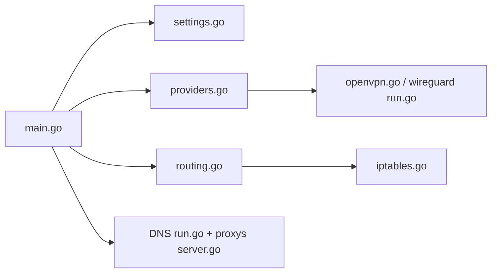

# qdm12/gluetun

> Conteneur client VPN multi-fournisseurs avec kill switch, pour y faire passer d'autres conteneurs.

## Le problème
Faire sortir des conteneurs ou des machines du réseau local via un VPN, sans configurer OpenVPN/WireGuard à la main pour chaque fournisseur.

## Ce que ça fait vraiment
Se connecte à une vingtaine de fournisseurs (OpenVPN, WireGuard, AmneziaWG pour config custom), pose un pare-feu kill switch, et propose DNS over TLS avec filtrage, proxys SOCKS5/HTTP/Shadowsocks, redirection de port pour PIA, PrivateVPN et ProtonVPN. Les autres conteneurs s'y rattachent.

## Comment c'est branché


## Essayer
```bash
# README : un docker-compose.yml (image qmcgaw/gluetun)
# cap_add: NET_ADMIN, devices: /dev/net/tun, VPN_SERVICE_PROVIDER=ivpn, VPN_TYPE=openvpn
```
Le README ne donne pas d'autre commande : tout passe par le compose et le wiki.

## Coût et pièges
Abonnement VPN requis (identifiants OpenVPN ou clé WireGuard). Droits `NET_ADMIN` et `/dev/net/tun`. Le dépôt annonce une migration vers `github.com/passteque/gluetun` ; les noms d'images restent.

## Ce que ce n'est pas
Pas un fournisseur VPN. Pas de support officiel pour Mullvad en OpenVPN (WireGuard seulement). Mainteneur unique.

## Alternatives
Aucune alternative nommée dans le README.

## Pour toi
À surveiller : utile pour isoler des scrapers ou jobs de données derrière un VPN, mais hors cœur data/IA et dépendant d'une seule personne.

