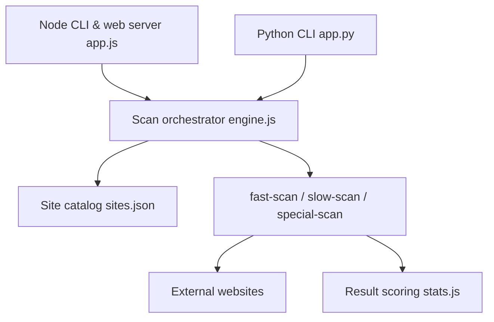

# qeeqbox/social-analyzer

> Outil OSINT local qui recherche et évalue des profils d'un nom d'utilisateur sur plus de mille sites.

## Le problème
Vérifier à la main si et où un pseudonyme existe sur des centaines de sites, avec le risque de faux positifs.

## Ce que ce n'est pas seulement
## Ce que ça fait vraiment
Prend un ou plusieurs noms d'utilisateur et évalue des profils candidats avec un score de 0 à 100 (non, peut-être, oui). Trois modes de vérification : rapide (HTTP), lent (navigateur piloté) et spécial (Google, Gmail, Facebook). Il ajoute analyse de noms, extraction de métadonnées, captures d'écran, filtres par pays, type ou classement, export JSON et graphe. Le README cite comme cadres d'usage l'enquête sur le harcèlement ou la désinformation, et dit être utilisé par certaines forces de l'ordre (avec une base de détection différente).

## Comment c'est branché


## Essayer
```bash
git clone https://github.com/qeeqbox/social-analyzer.git
cd social-analyzer
npm install
nodejs app.js --username "johndoe"
# ou en Python
pip3 install social-analyzer
python3 -m social-analyzer --username "johndoe"
```

## Coût et pièges
Gratuit ; les API Google et DuckDuckGo sont optionnelles. Selon les modes : Firefox ou Chrome, Tesseract, Node. Le README dit que l'outil est fait pour un usage local, sans contrôle d'accès, à ne pas exposer comme service. Les modules « private » ne sont pas dans le dépôt.

## Ce que ce n'est pas
Ce n'est pas une preuve d'identité : un profil « détecté » reste une probabilité. La recherche de données personnelles est encadrée (RGPD en Europe, finalité et base légale requises) ; il faut un cadre licite avant tout usage sur une personne. La licence AGPL-3.0 impose le partage du code d'un service dérivé.

## Alternatives
Aucune alternative nommée dans le README.

## Pour toi
À surveiller : pertinent pour une veille OSINT défensive dans un cadre légal clair, mais sans lien direct avec un travail data / IA, et le dernier commit date de janvier 2026.

