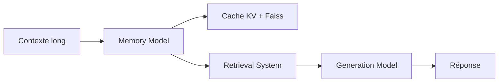

# qhjqhj00/MemoRAG

> Cadre RAG où un modèle à mémoire globale génère des indices pour mieux retrouver les passages utiles.

## Le problème
Le RAG classique gère mal les questions sans besoin d'information explicite, qui exigent une compréhension globale d'un long document.

## Ce que ça fait vraiment
Un modèle mémoire encode un long contexte (jusqu'à 1 M de tokens selon le README), puis produit des indices de recherche (`recall`) ou réécrit la requête. Ces indices alimentent un retriever (BGE-M3, index Faiss) puis un modèle générateur, local ou via API. Le cache KV, l'index et les passages sont sauvegardés : 35 s d'encodage contre 1,5 s au rechargement pour 200 K tokens. Un mode Lite et un article accepté à TheWebConf 2025.

## Comment c'est branché


## Essayer
```bash
pip install memorag
```
```python
from memorag import MemoRAGLite
pipe = MemoRAGLite()
context = open("examples/harry_potter.txt").read()
pipe.memorize(context, save_dir="harry_potter", print_stats=True)
print(pipe("What's the book's main theme?"))
```

## Coût et pièges
GPU de 16 à 24 Go recommandé ; Colab gratuit (T4) traite la moitié du livre d'exemple. Modèles Hugging Face à télécharger ; clé d'API seulement si générateur distant.

## Ce que ce n'est pas
Pas un produit prêt à l'emploi : c'est une base de recherche, dernier push 2025-09-11. Prompts par défaut en anglais, performances incertaines ailleurs.

## Alternatives
- RQ-RAG, HyDE, BGE-M3, Stella-v5 : comparés dans le tableau de résultats du README.

## Pour toi
Surveiller : idée utile pour le RAG sur longs documents et notebook Colab pour tester, mais activité en baisse.
