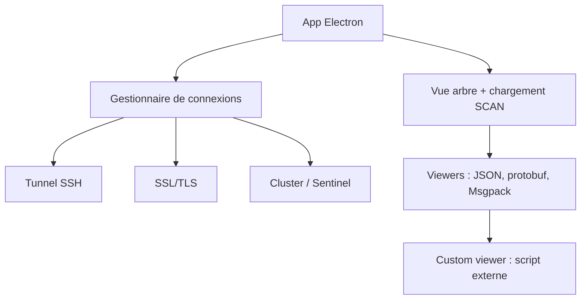

# qishibo/AnotherRedisDesktopManager

> Client graphique Redis multiplateforme, conçu pour tenir sur des bases à très nombreuses clés.

## Le problème
Les clients Redis graphiques s'écroulent au chargement de bases à millions de clés.
Inspecter une valeur binaire, protobuf ou compressée oblige à sortir de l'outil.

## Ce que ça fait vraiment
Client Electron pour Linux, Windows et macOS, distribué en exe, AppImage, dmg, snap, brew, chocolatey, winget.
Chargement des grosses clés par SCAN, vue en arbre, sélection et suppression multiples, analyse mémoire par dossier, mode lecture seule, journal d'exécution.
Formats : JSON éditable, Msgpack, protobuf, Java, Pickle, Brotli/Gzip/Deflate, RedisJSON, TimeSeries, Vector, ARRAY ; visualiseurs personnalisés appelant votre script avec `{KEY}`, `{VALUE}`, `{HEX}` ou `{HEX_FILE}`.
Connexions : Cluster, Sentinel, SSL/TLS, tunnel SSH (mot de passe ou clé privée), ACL Redis 6, groupes de connexions, démarrage par arguments CLI.

## Comment c'est branché


## Essayer
```bash
choco install another-redis-desktop-manager
winget install qishibo.AnotherRedisDesktopManager
sudo snap install another-redis-desktop-manager
brew install --cask another-redis-desktop-manager
```

## Coût et pièges
Gratuit via GitHub Releases et les gestionnaires de paquets ; les versions Windows Store et App Store sont payantes et servent de sponsoring.
Sous snap, il faut `sudo snap connect another-redis-desktop-manager:ssh-keys` pour accéder à `~/.ssh` ; sous macOS, retirer la quarantaine avec `xattr -rd`.

## Ce que ce n'est pas
Ce n'est pas un outil serveur ni un outil de monitoring de production : c'est un client de bureau.
Ce n'est pas un projet d'organisation : le journal de fonctionnalités montre des périodes d'un an sans nouveauté.
Les visualiseurs personnalisés exécutent des scripts locaux avec la valeur de la clé en argument : à manier prudemment.

## Alternatives
Aucune alternative n'est nommée dans le README.

## Pour toi
Utilitaire de confort ; à garder sous la main si tu manipules du Redis, sans en faire une dépendance d'équipe.
