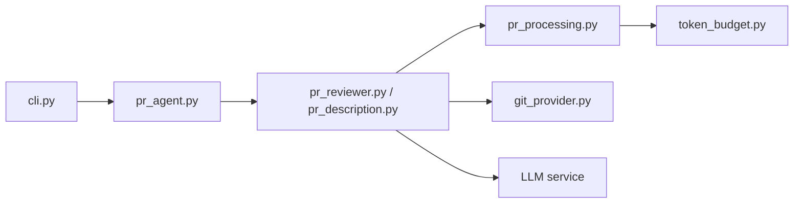

# qodo-ai/pr-agent

> Agent open source qui décrit, relit et améliore les pull requests avec un LLM.

## Le problème
Les revues de PR sont lentes et inégales ; la description est souvent bâclée.

## Ce que ça fait vraiment
Commandes `/describe`, `/review`, `/improve`, `/ask`, `/similar_issue`. Chaque outil fait un seul appel LLM. Compression des gros diffs. Fournisseurs Git : GitHub, GitLab, Bitbucket, Azure DevOps, Gitea ; modèles via LiteLLM. Projet « legacy » communautaire de Qodo, distinct de l'offre commerciale.

## Comment c'est branché


## Essayer
```bash
pip install pr-agent
export OPENAI_KEY=your_key_here
pr-agent --pr_url https://github.com/owner/repo/pull/123 review
```

## Coût et pièges
Clé LLM à ta charge. `/help_docs` désactivé depuis la v0.36.1 (fuite d'identifiants, #2445). Images Docker sous `pragent/pr-agent` depuis 0.34.2.

## Ce que ce n'est pas
Pas l'offre Qodo pour l'open source. Le README annonce un seul appel par outil ; la qualité dépend du modèle.

## Alternatives
Aucune alternative nommée dans le README.

## Pour toi
À adopter pour essayer la revue assistée en GitHub Action : MIT, actif (push fin septembre 2026), coût limité à tes appels LLM.

