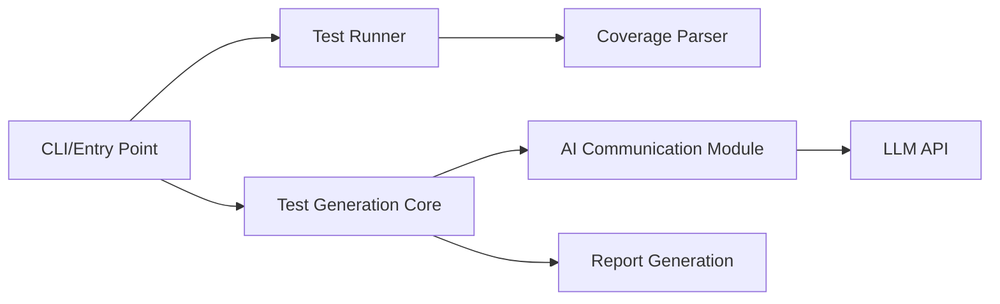

# qodo-ai/qodo-cover

> CLI qui génère par LLM des tests unitaires jusqu'à atteindre une couverture cible.

## Le problème
Écrire des tests pour du code existant est long ; la couverture stagne faute de temps.

## Ce que ça fait vraiment
Boucle : lancer la commande de test, lire le rapport de couverture (Cobertura, JaCoCo), construire un prompt, demander des tests au LLM.
Ne garde que les tests qui passent et augmentent la couverture, jusqu'à `--desired-coverage` ou `--max-iterations`.
Tout modèle via LiteLLM ; mode dépôt complet ; enregistrement/rejeu des réponses LLM.
Exemples Python, Go, Java ; rapport `test_results.html`.

## Comment c'est branché


## Essayer
```bash
pip install git+https://github.com/qodo-ai/qodo-cover.git
poetry install
cover-agent --source-file-path "templated_tests/python_fastapi/app.py" --test-file-path "templated_tests/python_fastapi/test_app.py" --project-root "templated_tests/python_fastapi" --code-coverage-report-path "templated_tests/python_fastapi/coverage.xml" --test-command "pytest --cov=. --cov-report=xml --cov-report=term" --test-command-dir "templated_tests/python_fastapi" --coverage-type "cobertura" --desired-coverage 70 --max-iterations 10
```

## Coût et pièges
Clé OpenAI (ou autre) à ta charge, facture par itération ; W&B optionnel reçoit prompts et réponses.

## Ce que ce n'est pas
Plus maintenu depuis juin 2025 selon le README. Couverture n'est pas qualité : les tests générés vérifient le comportement actuel, bugs compris. AGPL-3.0.

## Alternatives
Aucune alternative nommée dans le README (la version Pro de Qodo est commerciale).

## Pour toi
À ignorer : abandonné par son éditeur et sous AGPL, alors qu'un assistant de code actuel génère des tests aussi bien dans ton éditeur.
