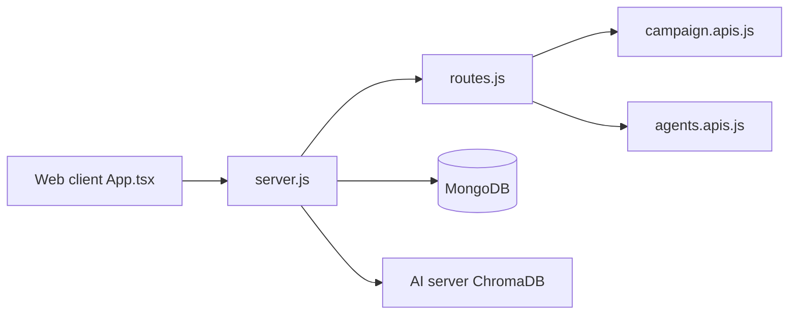

# qrev-ai/qrev

> Plateforme de vente à base d'agents IA se voulant alternative open source à Salesforce.

## Le problème
Les CRM classiques sont chers et peu personnalisables, et ne sont pas conçus autour d'agents.

## Ce que ça fait vraiment
Trois composants : client React, serveur d'application Node (MongoDB) et serveur IA séparé (Langchain, ChromaDB, SQLAlchemy). Le code montre agents, campagnes, CRM et intégrations (Zoom, Google). Un « super-agent » Qai doit coordonner des agents internes ; upload CSV de contacts pour générer des campagnes. Le README parle d'une version précoce.

## Comment c'est branché


## Essayer
```bash
git clone https://github.com/qrev-ai/qrev.git
cd server && npm ci && npm start
cd ../client && npm install && npm start
```

## Coût et pièges
Trois services à lancer, MongoDB, secrets JWT, identifiants Google et clés LLM. Dernier push février 2026.

## Ce que ce n'est pas
Pas un CRM prêt à l'emploi : développement actif, instructions de l'AI server renvoyées à un autre README. Licence AGPL-3.0 : obligations en cas d'hébergement.

## Alternatives
- Salesforce : cité comme la référence à remplacer.

## Pour toi
À ignorer : produit de vente hors de ton périmètre, AGPL et maturité faible.

