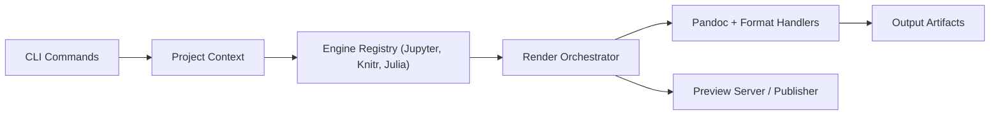

# quarto-dev/quarto-cli

> Système de publication scientifique basé sur Pandoc, qui exécute du code Python/R/Julia dans des documents Markdown.

## Le problème
Rapports, articles et sites mêlant code, résultats et texte se maintiennent mal à la main.

## Ce que ça fait vraiment
On écrit en Markdown avec du code exécuté par Jupyter, Knitr ou Observable ; Quarto convertit via Pandoc en HTML, PDF, livres ou sites. Ajoute références croisées, sous-figures, callouts, projets multi-documents, extensions, éditeur visuel et intégration JupyterLab, RStudio, VS Code. Publication et serveur de prévisualisation inclus.

## Comment c'est branché


## Essayer
```bash
git clone https://github.com/quarto-dev/quarto-cli
cd quarto-cli
./configure.sh
cd tests
./run-tests.sh
```

## Coût et pièges
Gratuit. Le README montre la version de développement ; l'installation stable passe par le site. Beaucoup d'issues (1 880). La licence est présente mais non identifiée par GitHub : à vérifier.

## Ce que ce n'est pas
Pas un environnement d'exécution : il s'appuie sur Jupyter, R ou Julia installés à part.

## Alternatives
Aucune nommée dans le README (Jupyter, Knitr et Pandoc sont des briques).

## Pour toi
À adopter : reproduire rapports et notebooks en documents publiables est au cœur d'un profil data ; vérifie la licence avant un usage d'entreprise.

