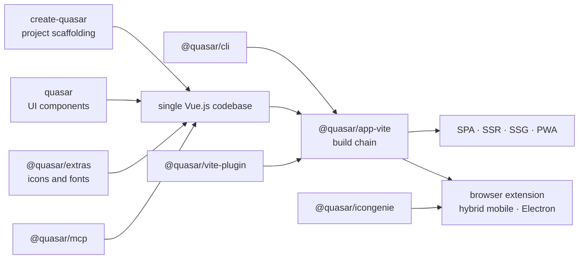

# quasarframework/quasar

> **A Vue.js framework for shipping web, mobile and desktop from one codebase.**

## The problem

Without a unified framework, shipping the same application as a single-page app, a
server-rendered app, a PWA, a mobile app and a desktop executable means maintaining as many
build chains as there are targets, each with its own tooling, UI components and configuration.

## What it actually does

Quasar is a Vue.js framework targeting several output formats from one codebase: single-page
apps, server-side rendering (SSR), static generation (SSG), PWAs, browser extensions, hybrid
mobile apps and Electron apps — the exact list given by the README.

The repository is a monorepo. The npm badges enumerate the published packages: `quasar` (the
core), `@quasar/app-vite` (the build chain), `@quasar/extras` (icons and fonts),
`@quasar/vite-plugin`, `@quasar/cli`, `@quasar/icongenie` (icon generation), `create-quasar`
(project scaffolding) and `@quasar/mcp`.

The README claims documentation and an API that a coding agent can read offline, and the
`@quasar/mcp` package points that way — its actual contents are not documented here. The CI
workflows shown cover UI tests, types, `app-vite`, the CLI, `create-quasar`, the Vite plugin,
utils and docs. The project follows Semantic Versioning 2.0.

## How it is wired

No code-derived diagram exists for this repository: the graph below is rebuilt from the
package names and workflows cited in the README alone.



## Trying it

The README documents **no command at all**: no install, no project creation, no build. It
defers entirely to the official website.

```bash
# No command is given in the README.
# The only documented entry point is the website: https://quasar.dev
```

Nothing should be reconstructed from memory: `create-quasar` and `@quasar/cli` are named in the
badges, but their exact invocation appears nowhere in this README.

## Cost and gotchas

- **Free, MIT licence**, copyright "2015-present Razvan Stoenescu". No API key, no GPU and no
  third-party service is required by the framework itself.
- **The real cost is the README**: most of it is badges, sponsors and community links.
  Everything technical — installation, configuration, components, build targets — lives on
  quasar.dev, outside the repository. You cannot evaluate the framework without leaving it.
- **Donation-funded**: the README explicitly asks for sponsorship (donate.quasar.dev) and lists
  around fifteen sponsors, presenting continued development as dependent on that support.
- **Eight separately versioned npm packages**, each with its own version badge — upgrades have
  to be coordinated.
- **Support** is a community Discord and forum; no contractual support is mentioned.

## What it is not

- **Not a data or AI tool.** The README's "AI-ready" claim is about documentation a coding
  agent can read, not machine-learning features. `@quasar/mcp` is named but never described.
- **Not independent of Vue.js**: it sits on top of Vue, it is not an alternative to React,
  Angular or Svelte. Choosing Vue is a prerequisite, not an option.
- **Not self-contained documentation**: the repository carries code and packages; the learning
  material is entirely on the external site.

## Alternatives

| | When to prefer it |
|---|---|
| **ToolJet/ToolJet** | Catalogue neighbour, a drag-and-drop internal app builder. Prefer it when the goal is an internal tool assembled without writing code; prefer Quasar when you are writing a Vue.js application and want several output targets. |

The other neighbours supplied (`xuanyustudio/LocalMiniDrama`, `xerrors/Yuxi`,
`apple/coreai-models`) are not comparable: nothing to do with a cross-platform UI framework.
The README names no competing project.

## For you

Little direct value for a data / AI / MLOps profile: this is a web UI framework, not a link in
a data chain. Keep it in mind only if you must ship a polished interface — an internal
dashboard, an annotation tool — across several targets at once, and Vue.js is already your
stack. Otherwise, walk past.
