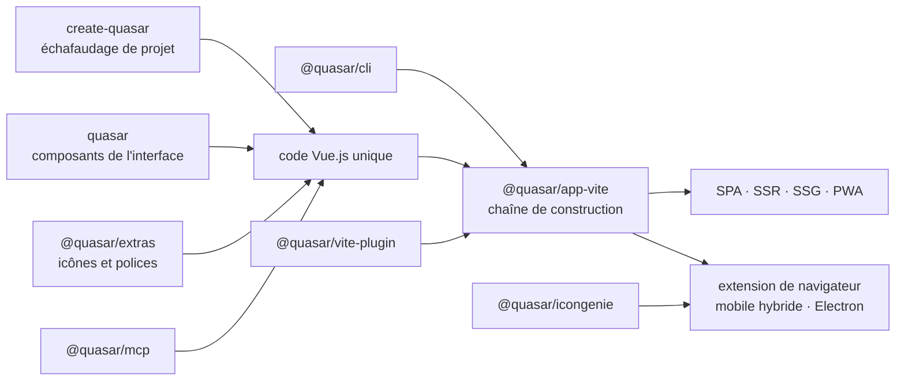

# quasarframework/quasar

> **Un cadre Vue.js pour livrer web, mobile et bureau depuis une seule base de code.**

## Le problème

Sans cadre unifié, livrer la même application en site monopage, en rendu serveur, en PWA, en
application mobile et en exécutable de bureau demande autant de chaînes de construction que de
cibles, chacune avec ses outils, ses composants d'interface et ses configurations à maintenir
en parallèle.

## Ce que ça fait vraiment

Quasar est un cadre Vue.js qui vise plusieurs cibles de sortie depuis le même code : site
monopage, rendu côté serveur (SSR), génération statique (SSG), PWA, extension de navigateur,
application mobile hybride et application Electron — c'est la liste exacte donnée par le README.

Le dépôt est un monorépo : les badges npm du README énumèrent les paquets publiés, à savoir
`quasar` (le cœur), `@quasar/app-vite` (la chaîne de construction), `@quasar/extras`
(icônes et polices), `@quasar/vite-plugin`, `@quasar/cli`, `@quasar/icongenie` (génération
d'icônes), `create-quasar` (échafaudage de projet) et `@quasar/mcp`.

Le README revendique une documentation et une API lisibles hors ligne par un agent de codage,
et l'existence du paquet `@quasar/mcp` va dans ce sens — le contenu précis de ce serveur MCP
n'est pas documenté ici. Les workflows d'intégration continue affichés couvrent les tests
d'interface, les types, `app-vite`, la CLI, `create-quasar`, le greffon Vite, les utilitaires
et la documentation. Le projet suit Semantic Versioning 2.0.

## Comment c'est branché

Aucun diagramme tiré du code n'existe pour ce dépôt : ce schéma est reconstruit depuis les
seuls noms de paquets et de workflows cités par le README.



## Essayer

Le README ne documente **aucune commande** : ni installation, ni création de projet, ni
construction. Il renvoie intégralement au site officiel.

```bash
# Aucune commande n'est donnée dans le README.
# Le seul point d'entrée documenté est l'adresse du site : https://quasar.dev
```

Ne rien reconstruire de mémoire : les paquets `create-quasar` et `@quasar/cli` sont nommés dans
les badges, mais leur invocation exacte n'est écrite nulle part dans ce README.

## Coût et pièges

- **Gratuit, licence MIT**, copyright « 2015-present Razvan Stoenescu ». Aucune clé d'API,
  aucun GPU, aucun service tiers n'est requis par le cadre lui-même.
- **Le vrai coût est le README** : il consacre l'essentiel de sa place aux badges, aux
  sponsors et aux liens communautaires. Tout ce qui est technique — installation,
  configuration, composants, cibles de construction — vit sur quasar.dev, hors du dépôt.
  Impossible d'évaluer le cadre sans sortir du README.
- **Financement par dons** : le README appelle explicitement au parrainage
  (donate.quasar.dev) et liste une quinzaine de sponsors. La pérennité du développement y est
  présentée comme dépendante de ce soutien.
- **Nombre de paquets à suivre** : huit paquets npm versionnés séparément, chacun avec son
  badge de version — les montées de version se coordonnent.
- **Support** : Discord et forum communautaires, pas de support contractuel mentionné.

## Ce que ce n'est pas

- **Ce n'est pas un outil de données ou d'IA.** La mention « AI-ready » du README porte sur la
  lisibilité de la documentation par un agent de codage, pas sur des fonctions d'apprentissage
  automatique. Le paquet `@quasar/mcp` est nommé mais non décrit.
- **Ce n'est pas indépendant de Vue.js** : c'est un cadre *au-dessus* de Vue, pas une
  alternative à React, Angular ou Svelte. Le choix de Vue est un préalable, pas une option.
- **Ce n'est pas une documentation autoportante** : le dépôt sert le code et les paquets ;
  la matière d'apprentissage est entièrement sur le site externe.

## Alternatives

| | Quand le préférer |
|---|---|
| **ToolJet/ToolJet** | Voisin du catalogue, constructeur d'applications internes en glisser-déposer. À préférer quand l'objectif est un outil interne assemblé sans écrire de code ; Quasar à préférer quand on écrit une application Vue.js et qu'on veut plusieurs cibles de sortie. |

Les autres voisins fournis (`xuanyustudio/LocalMiniDrama`, `xerrors/Yuxi`,
`apple/coreai-models`) ne sont pas comparables : rien à voir avec un cadre d'interface
multiplateforme. Le README ne nomme aucun projet concurrent.

## Pour toi

Peu de valeur directe pour un profil data / IA / MLOps : c'est un cadre d'interface web, pas
un maillon de chaîne de données. À garder sous la main uniquement si tu dois livrer une
interface soignée — tableau de bord interne, outil d'annotation — sur plusieurs cibles à la
fois, et que Vue.js est déjà ta pile. Sinon, passe ton chemin.
