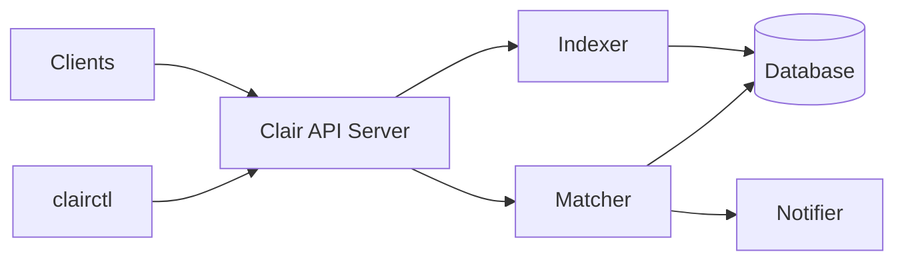

# quay/clair

> Service d'analyse statique des vulnérabilités d'images conteneurs OCI/Docker, via API.

## Le problème
Les images conteneurs embarquent des paquets vulnérables invisibles sans outil d'indexation et de correspondance avec les bases de CVE.

## Ce que ça fait vraiment
Le README est très court : les clients indexent leurs images via l'API Clair puis les confrontent aux vulnérabilités connues.
D'après l'architecture décrite : modules `indexer`, `matcher`, `notifier`, un CLI `clairctl`, une spec `openapi.yaml`, écrit en Go.
Toute la documentation est renvoyée vers « The book » externe.

## Comment c'est branché

## Essayer
Aucune commande documentée dans le README (utiliser les releases, pas `main`).

## Coût et pièges
Gratuit. La branche `main` peut être cassée : prendre une release. Base de données et déploiement non documentés ici.

## Ce que ce n'est pas
Pas un scanner CLI à lancer en une commande sur ton poste ; c'est un service à déployer. README insuffisant pour juger.

## Alternatives
Aucune nommée dans le README.

## Pour toi
À ignorer pour ton profil : sécurité des conteneurs hors cœur data/IA, et le README ne donne pas de quoi l'essayer sans lire une doc externe.
