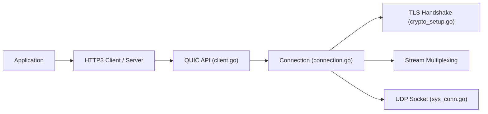

# quic-go/quic-go

> Implémentation du protocole QUIC et de HTTP/3 en Go pur, pour développeurs réseau.

## Le problème
Utiliser QUIC et HTTP/3 en Go sans dépendre de bibliothèques C.

## Ce que ça fait vraiment
Implémente QUIC (RFC 9000, 9001, 9002), les datagrammes, la version 2, qlog, et HTTP/3 avec QPACK. Depuis la v0.60, usage possible en environnement FIPS 140-3 avec Go 1.26 ou plus. Le README liste des projets qui l'utilisent (Caddy, traefik, syncthing, cloudflared…).

## Comment c'est branché

## Essayer
Aucune commande dans le README ; documentation sur quic-go.net.

## Coût et pièges
Gratuit. Suit les deux dernières versions de Go. 218 issues ouvertes.

## Ce que ce n'est pas
Pas un serveur web prêt à l'emploi : WebTransport, MASQUE et CONNECT-IP sont des projets liés distincts.

## Alternatives
webtransport-go, masque-go et connect-ip-go, pour les protocoles associés.

## Pour toi
Surveiller : brique d'infrastructure en Go, utile seulement si tu construis des services réseau ; sans lien avec la data/IA.

