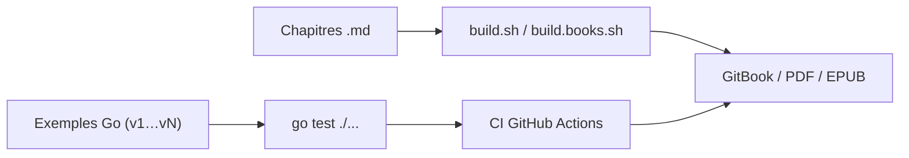

# quii/learn-go-with-tests

> Cours gratuit pour apprendre Go et le TDD en écrivant des tests, pour débutants en Go.

## Le problème
Apprendre un langage par la lecture seule reste abstrait et peu structuré.

## Ce que ça fait vraiment
Livre en chapitres : bases de Go (21 chapitres), construction d'une application (serveur HTTP, JSON, WebSockets, temps), fondamentaux du test (acceptance tests, fakes sans mocks, refactoring) et questions-réponses. Chaque chapitre a du code versionné (v1, v2…). Disponible en GitBook, EPUB ou PDF, avec de nombreuses traductions.

## Comment c'est branché

## Essayer
Aucune commande documentée dans le README fourni ; il renvoie à l'installation de Go et aux chapitres en ligne.

## Coût et pièges
Gratuit. Il faut Go, un éditeur et un peu d'expérience de programmation. Le contenu évolue avec les versions de Go (par exemple `testing/synctest`, Go 1.25).

## Ce que ce n'est pas
Ce n'est pas une référence du langage : il enseigne par l'exemple et par le test, sans exhaustivité.

## Alternatives
- Go by example : cité comme base d'apprentissage qui a fonctionné pour l'auteur.
- The Go blue book : cité comme trop exigeant en engagement.

## Pour toi
Surveiller : utile si tu dois écrire des outils ou services en Go ; sans intérêt si tu restes sur Python.

