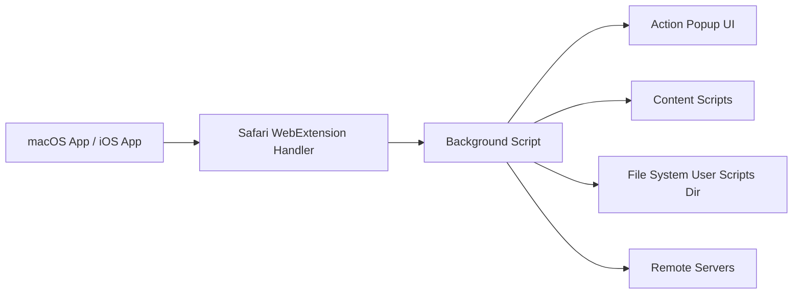

# quoid/userscripts

> Éditeur et gestionnaire de userscripts pour Safari, sur macOS et iOS.

## Le problème
Safari n'offre pas de gestionnaire de scripts utilisateur équivalent à Tampermonkey.

## Ce que ça fait vraiment
Une extension WebExtension (Svelte/Vite : popup, page, script de fond, scripts de contenu) lit et écrit des `.user.js` et `.css` dans un dossier choisi, via une appli native Swift. Elle gère `@match`, `@run-at`, `@require`, une API `GM.*` et la mise à jour par `@updateURL`.

## Comment c'est branché

## Essayer
Installation via l'App Store d'Apple (lien dans le README). Aucune commande documentée.

## Coût et pièges
Gratuit, mais distribué uniquement via l'App Store. `@require` télécharge des ressources distantes sans validation. Le README reconnaît que le processus de mise à jour n'est pas entièrement implémenté.

## Ce que ce n'est pas
Ce n'est pas un outil de scraping ni d'IA. Il ne fonctionne que sur Safari, et uniquement sur http/https.

## Alternatives
Aucune alternative nommée dans le README (Violentmonkey est cité comme référence de comportement).

## Pour toi
À ignorer : utilitaire Safari sans rapport avec le travail data/IA.

