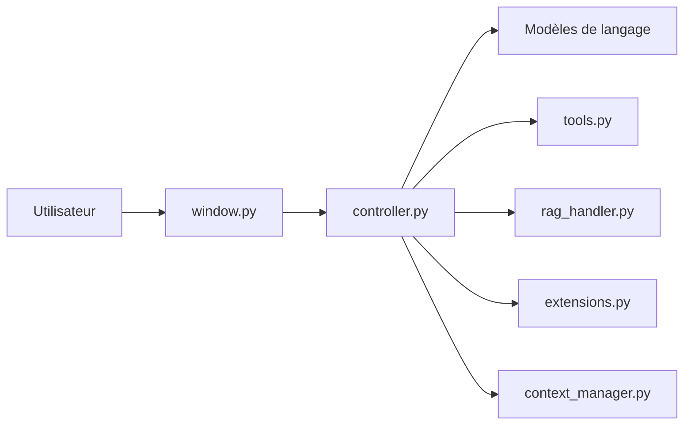

# qwersyk/Newelle

> Assistant IA de bureau GNOME : chat avec modèles, outils MCP, voix, documents et extensions.

## Le problème
Les assistants IA sont des services web fermés ; sur un bureau Linux, il manque un client local qui branche modèles, outils et fichiers.

## Ce que ça fait vraiment
Application de bureau (GNOME/Flatpak) où l'on discute avec plusieurs fournisseurs de modèles ou des modèles locaux (Llama.cpp, Ollama). Elle ajoute outils et MCP, skills, recherche web, RAG sur documents, voix, génération d'images, mémoire longue et exécution de commandes proposées par l'IA. Un contrôleur central orchestre les familles de handlers ; des extensions étendent le tout.

## Comment c'est branché


## Essayer
```bash
flatpak install flathub io.github.qwersyk.Newelle
flatpak run io.github.qwersyk.Newelle --mini
nix-shell -p newelle
```

## Coût et pièges
Clé d'API à ta charge pour les modèles distants. La version Flathub est sandboxée ; lui donner accès au terminal et aux fichiers réduit la sécurité, le README le dit.

## Ce que ce n'est pas
Pas un service hébergé ni une appli multiplateforme : c'est un client GNOME. Les builds hors Flathub n'ont pas les traductions. Aucune garantie de confidentialité côté modèles propriétaires.

## Alternatives
Aucune alternative citée dans le README (seul un fork, Nyarch Assistant, est mentionné).

## Pour toi
À surveiller : utile si tu travailles sous GNOME avec Ollama et MCP, mais c'est un client de bureau, pas une brique réutilisable dans un pipeline MLOps.

