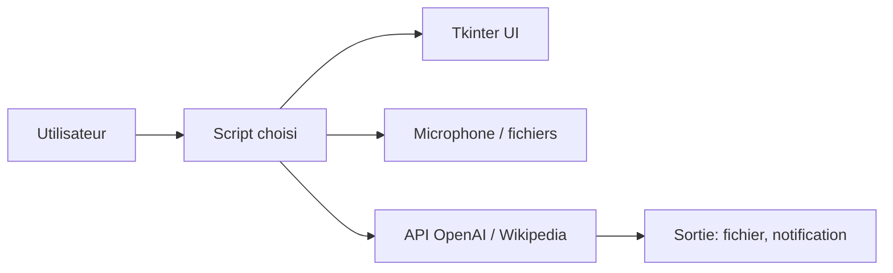

# qxresearch/qxresearch-event-1

> Collection de petits scripts Python d'une dizaine de lignes : utilitaires, tkinter, applications ChatGPT.

## Le problème
Débutants en Python cherchant des projets courts à lire et modifier, appuyés par des vidéos YouTube.

## Ce que ça fait vraiment
Scripts indépendants : enregistreur vocal, protection et fusion de PDF, raccourcisseur de liens, alarme, calendrier tkinter, Wikipédia, plus applications ChatGPT (chatbot, Whisper, base vectorielle, résumé web). L'architecture confirme qu'il s'agit d'applications séparées, sans produit intégré.

## Comment c'est branché


## Essayer
```bash
pip install -r requirements.txt
```
Les clés d'API se remplacent dans les fichiers `yml` de chaque projet.

## Coût et pièges
Les applications ChatGPT demandent une clé OpenAI. La configuration diffère par projet. Le README contient une adresse personnelle pour des cours particuliers et une demande d'abonnement YouTube.

## Ce que ce n'est pas
Pas une bibliothèque ni une référence de bonnes pratiques : du matériel pédagogique, dont la qualité n'est pas garantie.

## Alternatives
Non documenté dans le README.

## Pour toi
Ignorer : niveau débutant et démonstrations ; tes besoins data/MLOps sont couverts par des outils plus sérieux.
