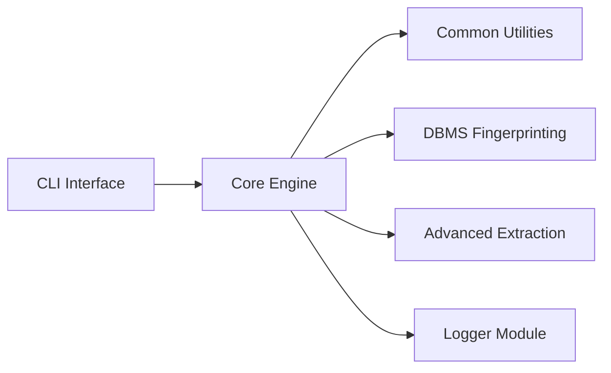

# r0oth3x49/ghauri

> Outil en ligne de commande de test d'injection SQL, destiné aux professionnels de la sécurité autorisés.

## Le problème
Vérifier qu'une application web est exposée à l'injection SQL est long à la main. L'auteur juge SQLMap difficile à configurer sur certains cas simples.

## Ce que ça fait vraiment
- Détecte des failles d'injection SQL sur des paramètres GET, POST, en-têtes, cookies, JSON, XML/SOAP et formulaires multipart.
- Prend en charge MySQL, SQL Server, Postgres, Oracle et, partiellement, Access.
- Reprend les sessions, accepte une requête HTTP sauvegardée (`-r`), un proxy et l'énumération des bases.
- Le README annonce en TODO le support des requêtes inline et UNION.

## Comment c'est branché


## Essayer
```bash
python3 -m pip install --upgrade -r requirements.txt
python3 -m pip install -e .
ghauri --help
```

## Coût et pièges
Gratuit. Pas de clé d'API. L'usage n'est légitime que sur des cibles dont on a l'autorisation écrite : le README rappelle que l'attaque sans consentement est illégale.

## Ce que ce n'est pas
Ce n'est pas un scanner de conformité ni un outil de défense. Il n'est pas présenté comme plus complet que SQLMap, l'auteur reconnaît des fonctions manquantes. Le comparatif du README est déclaratif, sans mesure.

## Alternatives
- SQLMap : plus riche en fonctions, cité par le README comme référence.

## Pour toi
Ignorer : outil de test d'intrusion, hors du périmètre data/IA/MLOps ; à ne considérer que dans un audit autorisé.

