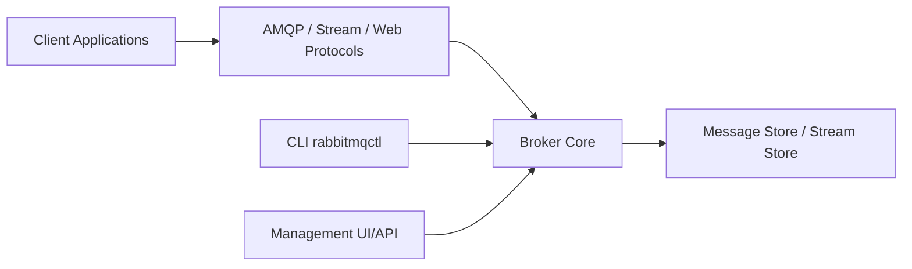

# rabbitmq/rabbitmq-server

> Broker de messages et de flux multi-protocole, pour équipes qui découplent des services.

## Le problème
Des services qui s'appellent en direct sont fragiles ; il faut une file de messages fiable entre eux.

## Ce que ça fait vraiment
Prend en charge AMQP 1.0 et 0-9-1, le protocole Stream, MQTT 3.1/3.1.1/5.0, STOMP, et MQTT/STOMP sur WebSocket. Files quorum répliquées et streams (journal persistant). Outils CLI (`rabbitmqctl`), interface de gestion et API HTTP, intégration OAuth/OIDC. L'architecture fournie est partielle : le cœur du broker n'a pas été échantillonné.

## Comment c'est branché

## Essayer
Aucune commande dans le README : il renvoie aux guides d'installation, au Kubernetes Cluster Operator et aux tutoriels.

## Coût et pièges
Le logiciel est gratuit ; exige une version d'Erlang supportée. La licence est indiquée comme MPL 2.0 dans le README mais non identifiée par GitHub. AMQP 1.0 sur WebSocket relève de VMware Tanzu RabbitMQ.

## Ce que ce n'est pas
Pas une base de données ni un moteur de streaming analytique.

## Alternatives
Aucune alternative citée dans le README.

## Pour toi
À adopter : brique classique pour alimenter des pipelines de données par messages, sous MPL 2.0 et maintenue par Broadcom, avec Kubernetes Operator.

