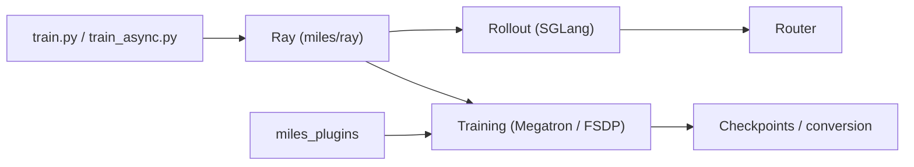

# radixark/miles

> Framework d'apprentissage par renforcement pour le post-entraînement de très gros modèles, sur SGLang et Megatron-LM.

## Le problème
Faire du RL (GRPO, PPO) sur des modèles de très grande taille exige de faire tourner génération et entraînement en parallèle, sans divergence entre les deux.

## Ce que ça fait vraiment
Sépare rollout (SGLang derrière un routeur) et entraînement (Megatron-LM, ou FSDP2 en secondaire), orchestrés par Ray, en mode asynchrone. Propose : jetons entrants-sortants (TITO), rejeu du routage MoE (R3), reprise à chaud si un moteur tombe, entraînement MXFP8/NVFP4/FP8/INT4, LoRA multiple, environnements d'agents (Harbor, HUD, Verifiers, etc.) et diffusion. Issu du fork de slime. Support GPU NVIDIA et AMD.

## Comment c'est branché

## Essayer
Le README ne donne pas de commande : il renvoie vers « Install Miles » et « Quick Start » (documentation externe).

## Coût et pièges
Suppose des grappes de GPU récents (H100/B200/MI300…). 1 015 issues ouvertes. Les résultats de vitesse annoncés (poids en secondes sur un modèle à un billion de paramètres) ne sont pas vérifiables ici.

## Ce que ce n'est pas
Pas un outil de fine-tuning léger : conçu pour le post-entraînement à grande échelle, avec une infrastructure conséquente.

## Alternatives
`slime`, dont il est issu (cité dans le README).

## Pour toi
Ignorer : l'échelle visée (grappes multi-GPU) dépasse un profil data/MLOps courant ; à ressortir pour un projet de RL sur LLM.
