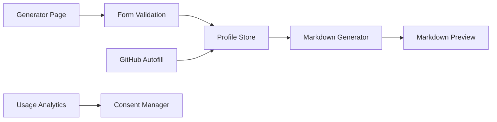

# rahuldkjain/github-profile-readme-generator

> Application web qui génère un README de profil GitHub à partir d'un formulaire.

## Le problème
Écrire à la main un README de profil avec badges, statistiques et icônes.

## Ce que ça fait vraiment
On remplit un formulaire (nom, liens, réseaux, compétences) et l'outil produit du Markdown, avec aperçu, copie et téléchargement. Options : compteur de visiteurs, stats GitHub, séries de contributions, blogs dynamiques (GitHub Action), Wakatime. Application Next.js 15 côté client, avec sauvegarde locale et remplissage automatique via l'API GitHub.

## Comment c'est branché


## Essayer
```bash
git clone https://github.com/rahuldkjain/github-profile-readme-generator.git
cd github-profile-readme-generator
npm install
npm run dev
```

## Coût et pièges
Gratuit. Le README annonce Google Analytics 4 avec bannière de consentement. La police Wotfard est utilisée « sous fair use » : le README demande de vérifier la licence pour un usage commercial.

## Ce que ce n'est pas
Ce n'est pas un outil de développement : il génère du Markdown décoratif. Les badges dépendent de services tiers externes.

## Alternatives
Aucune alternative nommée dans le README.

## Pour toi
Ignorer : sert à décorer une page de profil, sans valeur pour un travail data/IA ; télémétrie et licence de police floue en prime.

