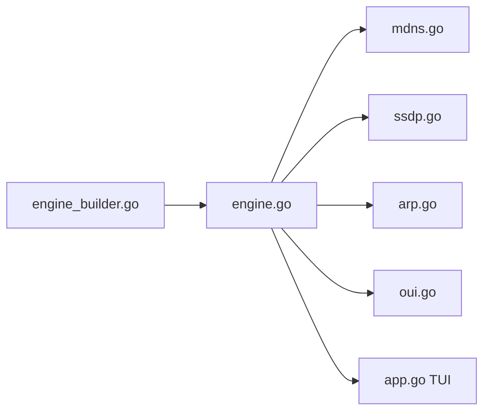

# ramonvermeulen/whosthere

> Outil Go à interface terminal qui découvre les appareils d'un réseau local, sans privilèges.

## Le problème
Savoir ce qui est connecté au réseau local demande souvent des droits administrateur ou des outils lourds.

## Ce que ça fait vraiment
Trois scanners concurrents (mDNS, SSDP, ARP) plus un balayage de sous-réseau qui remplit le cache ARP ; les fabricants sont retrouvés par OUI. Interface TUI avec recherche regex, scan unique en CLI avec sortie JSON, mode démon avec API HTTP (`/devices`, `/device/{ip}`, `/health`), scanner de ports optionnel et alias persistants.

## Comment c'est branché


## Essayer
```bash
brew install whosthere
whosthere
whosthere scan -t 5 --json --pretty > devices.json
whosthere daemon --port=8080
```

## Coût et pièges
Gratuit. N'utiliser que sur des réseaux autorisés ; le presse-papiers demande un outil de copie selon l'OS.

## Ce que ce n'est pas
Pas un outil de supervision professionnel : l'auteur le dit, les résultats peuvent être incomplets.

## Alternatives
Aucune alternative nommée dans le README.

## Pour toi
À surveiller : pratique pour inventorier un réseau domestique ou de labo, sans enjeu pour ton travail data.

