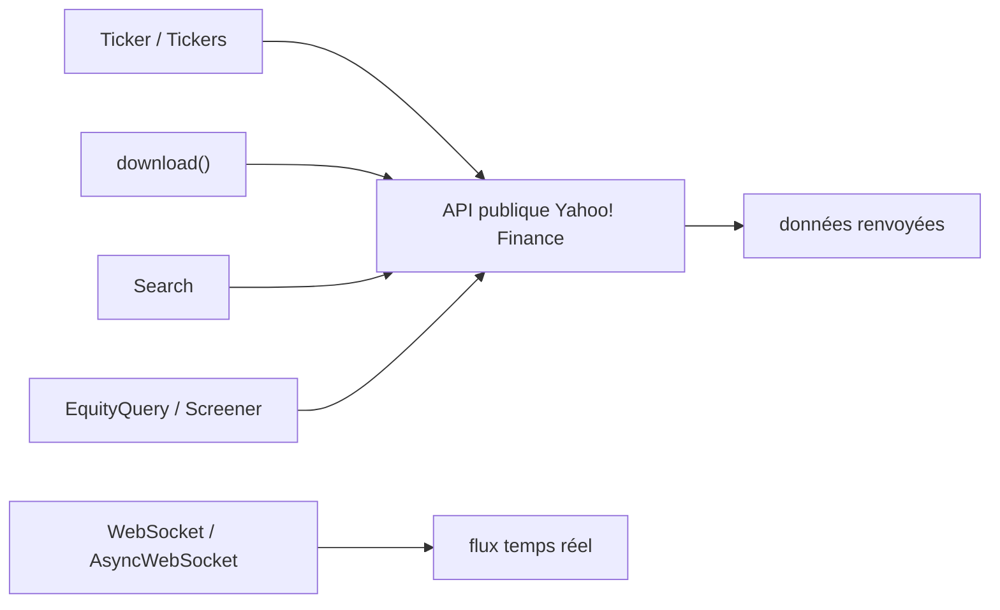

# ranaroussi/yfinance

> Accès Python aux données de marché de Yahoo! Finance, pour la recherche et l'apprentissage.

## Le problème
Les données de marché fiables sont derrière des abonnements coûteux ou des API à quotas serrés.
Télécharger à la main des historiques pour plusieurs titres devient vite une corvée de scripts jetables.

## Ce que ça fait vraiment
`Ticker` pour un titre, `Tickers` pour plusieurs, `download` pour récupérer les données de marché en lot.
`Market` renseigne sur une place ; `Sector` et `Industry` donnent les informations sectorielles.
`Search` remonte cotations et actualités ; `EquityQuery` et `Screener` construisent des filtres de sélection de titres.
`WebSocket` et `AsyncWebSocket` pour du flux de données en direct.

## Comment c'est branché


## Essayer
```bash
pip install yfinance
```

## Coût et pièges
Gratuit, sans clé : le coût est la fragilité, puisqu'il s'appuie sur des API publiques non contractuelles.
L'installation sans `curl_cffi` (repli des requêtes) est documentée à part, dans la section Advanced.

## Ce que ce n'est pas
Ce n'est pas un produit Yahoo : le projet n'est ni affilié, ni approuvé, ni validé par Yahoo, Inc.
Ce n'est pas une source de données pour un produit : les conditions de Yahoo visent l'usage personnel, et le projet se présente comme destiné à la recherche et à l'enseignement.
Ce n'est pas une garantie de disponibilité : aucune stabilité d'API n'est promise côté amont.

## Alternatives
Aucune alternative nommée dans le README.

## Pour toi
Parfait pour prototyper une série temporelle financière ; à remplacer par un fournisseur sous contrat dès que ça sort du bac à sable.
