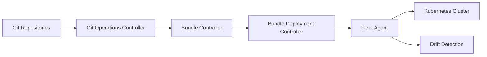

# rancher/fleet

> Contrôleur GitOps et HelmOps pour déployer YAML, Helm ou Kustomize sur beaucoup de clusters Kubernetes.

## Le problème
Déployer et auditer les mêmes applications sur de nombreux clusters ou équipes devient ingérable à la main.

## Ce que ça fait vraiment
Surveille des dépôts Git (ressource `GitRepo`), transforme toute source (YAML brut, Helm, Kustomize) en chart Helm, puis un agent par cluster déploie via Helm, détecte les dérives et remonte le statut. Contrôleurs pour bundles, clusters, groupes, HelmOps et scan d'images. Fonctionne aussi sur un seul cluster.

## Comment c'est branché


## Essayer
```bash
helm -n cattle-fleet-system install --create-namespace --wait fleet-crd https://github.com/rancher/fleet/releases/download/v0.16.1/fleet-crd-0.16.1.tgz
helm -n cattle-fleet-system install --create-namespace --wait fleet https://github.com/rancher/fleet/releases/download/v0.16.1/fleet-0.16.1.tgz
kubectl apply -f example.yaml
kubectl -n fleet-local get fleet
```

## Coût et pièges
Cluster Kubernetes et Helm 3 requis ; 173 issues ouvertes. Le README ne détaille pas la sécurité ni la montée en charge.

## Ce que ce n'est pas
Pas un outil de MLOps en soi : il déploie des manifestes, il ne gère ni modèles ni pipelines de données.

## Alternatives
Aucune alternative nommée dans le README.

## Pour toi
À surveiller : utile si tu déploies des plateformes ML sur plusieurs clusters ; superflu pour un seul environnement simple.
