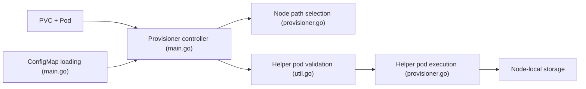

# rancher/local-path-provisioner

> Provisionneur Kubernetes qui crée dynamiquement des volumes hostPath ou local sur les nœuds, pour admins de clusters.

## Le problème
Le provisionneur de volumes locaux natif de Kubernetes ne sait pas faire de provisionnement dynamique : il faut créer les PV à la main.

## Ce que ça fait vraiment
Un démon lit une ConfigMap (`config.json`, `setup`, `teardown`, `helperPod.yaml`), puis, à chaque PVC, choisit un chemin par nœud et lance un pod d'aide qui crée ou supprime le répertoire du volume. Le type (`hostPath` ou `local`) se règle par annotation. Un `sharedFileSystemPath` permet aussi les modes RWX. La config est rechargée à chaud ; en cas d'erreur, la dernière config valide reste utilisée.

## Comment c'est branché


## Essayer
```bash
kubectl apply -f https://raw.githubusercontent.com/rancher/local-path-provisioner/v0.0.37/deploy/local-path-storage.yaml
kubectl create -f https://raw.githubusercontent.com/rancher/local-path-provisioner/master/examples/pvc/pvc.yaml
kubectl create -f https://raw.githubusercontent.com/rancher/local-path-provisioner/master/examples/pod/pod.yaml
kubectl get pv
```

## Coût et pièges
Gratuit, Kubernetes v1.12+ requis. Le helper pod est validé par défaut ; l'option `--allow-unsafe-helper-pod-template` désactive ces garde-fous.

## Ce que ce n'est pas
Pas un stockage répliqué : les données restent sur un seul nœud (affinité sur `kubernetes.io/hostname` par défaut). La limite de capacité demandée est ignorée pour l'instant.

## Alternatives
- Local Persistent Volume natif de Kubernetes : intégré, mais sans provisionnement dynamique.

## Pour toi
À adopter pour un cluster de dev ou un homelab où un volume local suffit ; inadapté si tu as besoin de réplication ou de quotas de capacité.

