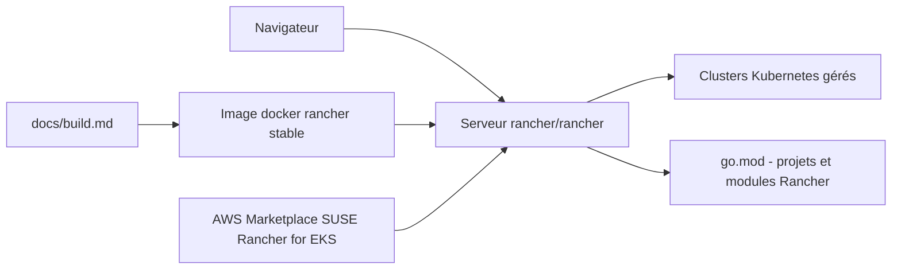

# rancher/rancher

> **Self-hosted platform for managing Kubernetes clusters, aimed at IT and DevOps teams in production.**

## The problem

Without it, every Kubernetes cluster is administered on its own, with its own credentials, its
own tooling and no shared view. The README frames the need as "run Kubernetes everywhere, meet
IT requirements, and empower DevOps teams", without explaining the mechanics — which already
says something about how much detail this file carries.

## What it actually does

Rancher describes itself as an open source container management platform for organizations that
deploy containers in production. It runs as a single containerized server exposing a web
interface over HTTP and HTTPS (ports 80 and 443), from which Kubernetes is administered. The
repository itself is described as a packaging meta-repo: it holds most of the Rancher codebase,
while the remaining projects and modules are listed in `go.mod`. The README documents neither
the APIs nor the object model nor the administration features in detail — everything points to
`ranchermanager.docs.rancher.com`.

## How it is wired



Reading: the `rancher/rancher` image published on Docker Hub runs as a single container and
becomes the Rancher server; the user reaches it in a browser at `https://localhost`, and that
server is what drives the managed Kubernetes clusters. What the server contains is assembled
from this repository plus the dependencies declared in `go.mod`, with build customization
documented in `docs/build.md`. An alternative distribution exists through the AWS Marketplace
for EKS. The README names no other source file.

## Trying it

```bash
sudo docker run -d --restart=unless-stopped -p 80:80 -p 443:443 --privileged rancher/rancher
```

Then open `https://localhost` in a browser. This is the only command present in the README;
all other installation options are deferred to the online documentation.

## Cost and traps

The code is Apache-2.0 and the README mentions no payment. The real cost lies elsewhere: the
quick-start container runs `--privileged` and takes over ports 80 and 443 on the host, which is
not harmless on a shared machine. Hardware requirements and supported operating systems are not
given here: you must go through the support matrix and the "Installation Requirements" page
linked from the README, both of which vary per Rancher version. The project is published by
SUSE, with forums and release announcements hosted by SUSE — the dependency is editorial rather
than technical.

## What it is not

It is not a Kubernetes distribution: Rancher administers clusters, it does not replace the
runtime or the scheduler. It is not a self-contained application repository either — the README
says so itself, this is a packaging meta-repo whose components partly live in other repositories
referenced from `go.mod`. And this README is not documentation: installation, configuration and
usage are all delegated to an external site, so trying it from this file alone means starting a
container and then discovering the interface unguided.

## Alternatives

No comparable alternative in the catalogue: the README names no competitor, and the suggested
neighbours sit at other layers of the container stack — `containerd/containerd` is a runtime
(what Rancher drives, not what it replaces), `goharbor/harbor` is an image registry,
`google/gvisor` a sandboxing layer, and `abiosoft/colima` a local Docker environment for a
workstation. They combine with Rancher rather than substitute for it.

## For you

Worth a look if you operate the clusters your training jobs or inference services run on:
Rancher gives one console for several clusters, which avoids juggling kubeconfigs. Skip it if
you consume managed Kubernetes without owning its administration — the value is on the ops side,
not the modelling side.
