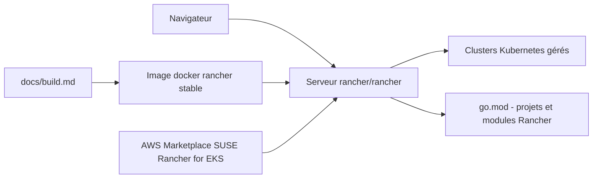

# rancher/rancher

> **Plateforme auto-hébergée d'administration de clusters Kubernetes, pour équipes IT et DevOps en production.**

## Le problème

Sans elle, chaque cluster Kubernetes s'administre séparément, avec ses propres accès, ses
propres outils et aucune vue d'ensemble. Le README pose le besoin en ces termes : « run
Kubernetes everywhere, meet IT requirements, and empower DevOps teams », sans détailler
les mécanismes — c'est déjà un signal sur le niveau de détail disponible ici.

## Ce que ça fait vraiment

Rancher se présente comme une plateforme open source de gestion de conteneurs destinée aux
organisations qui déploient des conteneurs en production. Elle se lance comme un serveur
conteneurisé unique qui expose une interface web en HTTP et HTTPS (ports 80 et 443), depuis
laquelle on administre Kubernetes. Le dépôt lui-même est décrit comme un *meta-repo* de
packaging : il contient la majeure partie du code de Rancher, le reste des projets et modules
étant listés dans le `go.mod`. Le README ne documente ni les API, ni le modèle d'objets, ni
le détail des fonctions d'administration — tout renvoie vers `ranchermanager.docs.rancher.com`.

## Comment c'est branché



Lecture : l'image `rancher/rancher` publiée sur Docker Hub est lancée en conteneur unique et
devient le serveur Rancher ; l'utilisateur l'atteint par navigateur sur `https://localhost`,
et c'est ce serveur qui pilote les clusters Kubernetes. Le contenu réel du serveur est
assemblé à partir du dépôt et des dépendances déclarées dans `go.mod`, la personnalisation du
build passant par `docs/build.md`. Une distribution alternative existe via l'AWS Marketplace
pour EKS. Le README ne nomme aucun autre fichier du code.

## Essayer

```bash
sudo docker run -d --restart=unless-stopped -p 80:80 -p 443:443 --privileged rancher/rancher
```

Puis ouvrir `https://localhost` dans le navigateur. C'est la seule commande présente dans le
README ; toutes les autres options d'installation sont renvoyées vers la documentation en ligne.

## Coût et pièges

Le code est sous Apache-2.0 et aucun paiement n'est mentionné dans le README. Le vrai coût est
ailleurs : le conteneur de démarrage rapide tourne en `--privileged` et accapare les ports 80
et 443 de la machine, ce qui n'est pas anodin sur un hôte partagé. Les prérequis matériels et
les systèmes d'exploitation supportés ne sont pas donnés ici : il faut passer par la matrice de
support et la page « Installation Requirements » liées dans le README, qui varient selon la
version de Rancher. Le projet est édité par SUSE, avec les forums et les annonces hébergés chez
SUSE — la dépendance est éditoriale plutôt que technique.

## Ce que ce n'est pas

Ce n'est pas une distribution Kubernetes : Rancher administre des clusters, il ne remplace pas
le runtime ni l'ordonnanceur. Ce n'est pas non plus un dépôt applicatif lisible d'un bloc — le
README le dit lui-même, c'est un meta-repo de packaging dont une partie des composants vit dans
d'autres dépôts référencés par `go.mod`. Enfin ce README n'est pas une documentation :
installation, configuration et usage sont tous délégués à un site externe, et le tester à partir
de ce seul fichier revient à lancer un conteneur puis à découvrir l'interface sans guide.

## Alternatives

Aucune alternative comparable dans le catalogue : le README ne nomme aucun concurrent, et les
voisins proposés relèvent d'autres couches de la pile conteneurs — `containerd/containerd` est
un runtime (ce que Rancher pilote, pas ce qu'il remplace), `goharbor/harbor` est un registre
d'images, `google/gvisor` un bac à sable d'isolation, et `abiosoft/colima` un environnement
Docker local pour poste de travail. On peut les combiner avec Rancher, pas les substituer.

## Pour toi

Intéressant si tu exploites toi-même les clusters sur lesquels tournent tes entraînements ou
tes services d'inférence : Rancher donne une console unique pour plusieurs clusters, ce qui
évite de multiplier les kubeconfig. À ignorer si tu consommes du Kubernetes managé sans en
porter l'administration — la valeur est côté ops, pas côté modèle.
