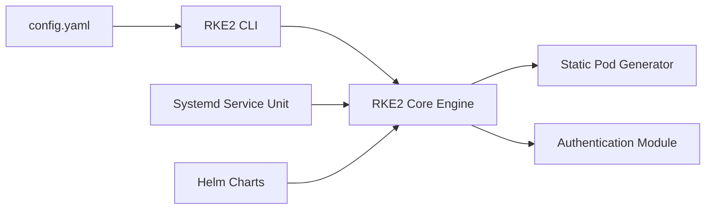

# rancher/rke2

> Distribution Kubernetes de Rancher, axée sécurité et conformité, pour opérateurs d'infrastructure.

## Le problème
Durcir un cluster Kubernetes pour passer le benchmark CIS, le FIPS et SELinux demande beaucoup de configuration manuelle.

## Ce que ça fait vraiment
RKE2 (« RKE Government ») est une distribution Kubernetes conforme, avec des défauts permettant de passer le CIS Benchmark avec peu d'intervention. Elle active FIPS 140-2, gère SELinux et MCS, et scanne les composants avec trivy dans le pipeline de build. Installée en service systemd, configurée par `/etc/rancher/rke2/config.yaml`. Les versions suivent Kubernetes amont (patchs sous une semaine visés).

## Comment c'est branché


## Essayer
```bash
curl -sfL https://get.rke2.io | sh -
systemctl enable rke2-server.service
systemctl start rke2-server.service
# Wait a bit
export KUBECONFIG=/etc/rancher/rke2/rke2.yaml PATH=$PATH:/var/lib/rancher/rke2/bin
kubectl get nodes
```

## Coût et pièges
Gratuit ; nécessite une machine Linux et des droits root pour le service systemd. Le script d'installation est récupéré par `curl | sh`.

## Ce que ce n'est pas
Pas un outil data/IA : c'est une plateforme d'infrastructure. Orientée secteur public américain, elle n'est pas la plus légère (la FAQ la compare à RKE1 et K3s).

## Alternatives
- K3s : cité en FAQ comme comparaison, sans détail dans le README.
- RKE1 : idem.

## Pour toi
Surveiller : solide si tu opères des clusters sous contrainte de conformité pour du MLOps, inutile pour un poste de data scientist.
