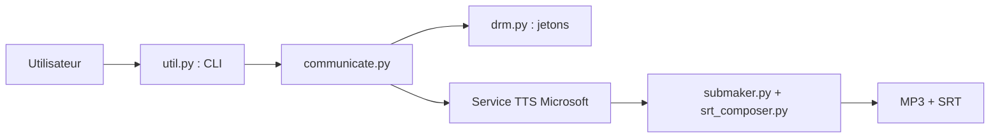

# rany2/edge-tts

> Module Python et commandes pour utiliser la synthèse vocale en ligne de Microsoft Edge.

## Le problème
Obtenir de la voix de qualité sans clé d'API ni GPU local.

## Ce que ça fait vraiment
Envoie le texte au service TTS de Microsoft Edge, reçoit l'audio en flux plus les repères de timing, et écrit un MP3 et des sous-titres SRT. Permet de choisir la voix, le débit, le volume et la hauteur. `edge-playback` lit le résultat tout de suite (nécessite `mpv`, sauf sous Windows).

## Comment c'est branché


## Essayer
```bash
pip install edge-tts
edge-tts --text "Hello, world!" --write-media hello.mp3 --write-subtitles hello.srt
edge-tts --list-voices
edge-playback --text "Hello, world!"
```

## Coût et pièges
Gratuit côté utilisateur, mais le service Microsoft peut changer ou restreindre l'accès. Pas de clé requise. Licence « présente mais non identifiée par GitHub ».

## Ce que ce n'est pas
Pas un moteur local : sans réseau, rien ne marche. Le SSML personnalisé a été retiré car Microsoft n'accepte que ce que Edge génère.

## Alternatives
- Aucune alternative nommée dans le README.

## Pour toi
À surveiller : pratique pour prototyper une sortie vocale (podcasts, démos) sans GPU, mais dépend d'un service non contractuel.

