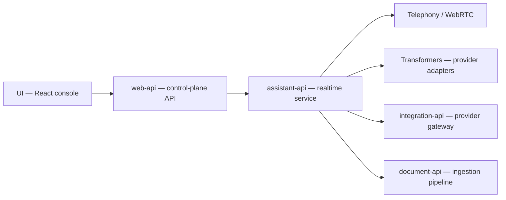

# rapidaai/voice-ai

> Plateforme open source d'orchestration d'agents vocaux, auto-hébergeable, pour agences et entreprises.

## Le problème
Bâtir un agent vocal temps réel impose de raccorder téléphonie, STT, LLM, TTS et observabilité à la main.

## Ce que ça fait vraiment
Backend Go (gRPC) en quatre services : web-api (plan de contrôle), assistant-api (sessions vocales temps réel, VAD, débruitage, détection de fin de parole), endpoint-api et integration-api (passerelle de fournisseurs). Un service Python `document-api` gère l'ingestion RAG. Adaptateurs de téléphonie (Twilio, Vonage, Telnyx, SIP, WebRTC) et console React.

## Comment c'est branché


## Essayer
```bash
git clone https://github.com/rapidaai/voice-ai.git && cd voice-ai
just setup-local build-all
just up-all
docker compose ps
```

## Coût et pièges
16 Go de RAM ou plus, Docker, Just, Go 1.25.13 et Node 22 pour `just ci`. Les clés OpenAI, Anthropic, Deepgram, Twilio etc. se mettent dans des fichiers YAML. Sans Docker : PostgreSQL, Redis et OpenSearch à fournir. Le service document-api est signalé comme déprécié dans le pipeline CI.

## Ce que ce n'est pas
Pas un service géré prêt à l'emploi : vous exploitez tout. Les mentions de fiabilité et de gouvernance sont des déclarations du README, non mesurées ici.

## Alternatives
Aucune alternative citée dans le README.

## Pour toi
À surveiller si tu prototypes de la voix IA auto-hébergée ; la licence non reconnue et l'infrastructure lourde freinent une adoption directe.
